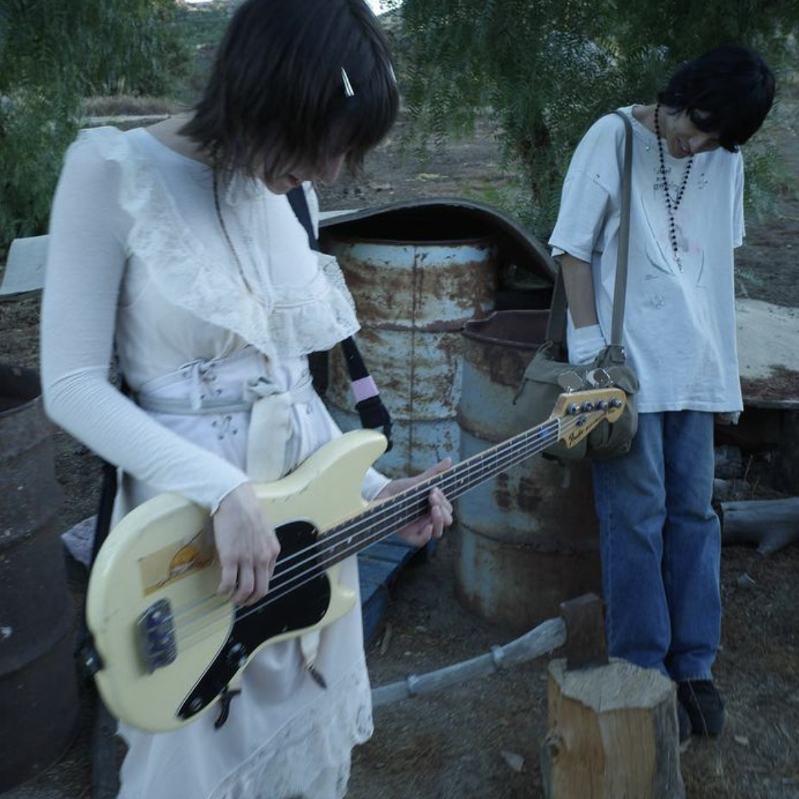
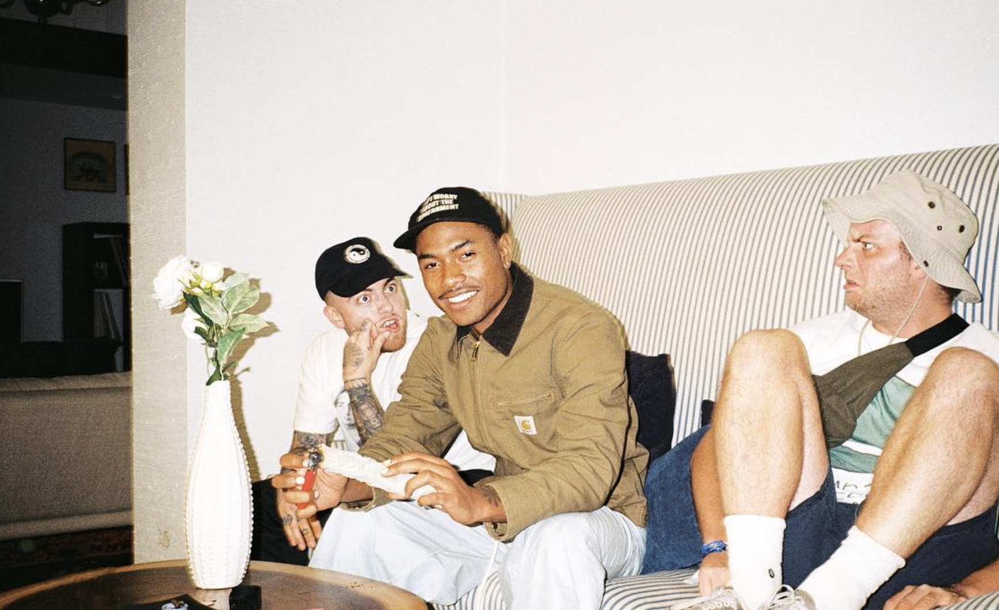
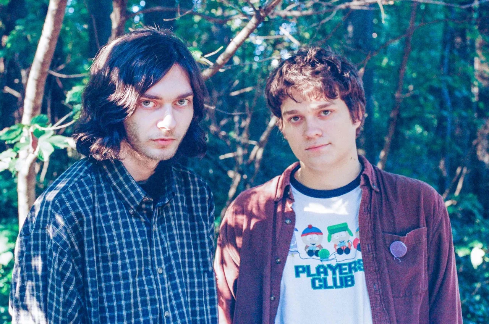

### 11/1/2023 Julie 


[stolenbesos](https://www.instagram.com/p/C2-33Ayy0dW/?hl=en&img_index=1) via IG

Maybe tomorrow’s title should be called “Julie”. Because I’m seeing them tonight, so won’t I have more to say on the show until tomorrow. Shit is this blog boring af? 

I’m not feeling work today at all. Transitioning from “new employee” work to “actual” work sucks for me because I’m too used to the new employee work. Getting my hand held. Having a lot of time. Having the work be easy. You feel like you need to do more. Your managers act as a panopticon making you wonder if they're going to walk by and see you not doing work. Or see you not at your desk. Or seeing you write a blog complaining about work. 

This job has scared me straight. I try to take my time here as a lesson to hustle when I don’t work here anymore so I never have to work in a place like this again. I’m the only one of my friends who has a salaried job with benefits out of school. I don’t realize how good I have it. I feel sick today and don’t have enough PTO to take off work. But they don’t even know what PTO is. In a figurative sense of course. I have so much free time to learn new things. I pretty much taught myself guitar theory while working here. It does pay me well. Hopefully I’ll be able to pay off my loans sooner than I thought. There are good restaurants around for lunch. Commuting is manageable. I have some former colleagues here. I made some friends here who I see everyday. None of my coworkers are bad. Work is easy. And yet…

I want out. I feel lied to and betrayed by the system. All this extra time and work and energy into school for 16 years for me to land a random job. Did I want this? Was this the light at the end of the tunnel? What else did I think would happen? I remember wanting a computer science degree so I can land a job and have enough time and money to do my hobbies on the side. And that’s basically what I have now. I wanted to travel more but with my soul glued to the area’s underground music scene I won’t be leaving anytime soon. 

The thing that gets me is something I put a higher price on everyday. And that is my time. 

Work takes my time. 

It takes it right away from my feeble little body navigating this reality. 

Existential dread comes out of nowhere some days to push me to the ground and kick in my ribs. Make my heart ache. Make my anxiety skyrocket. Where was the class in school that addressed this daily problem? Oh, is it therapy? It's just the fact that I don’t think my job does ANYTHING for the betterment of society and humanity as a whole. 

I could have hunted, killed, and dragged a deer back to the village so all my loved ones get to eat. I don’t even get a glimpse of the feelings I’d imagine that hunter persona of me would have. My job, that I do everyday, feels completely pointless. And feeling that on a daily basis sucks. 

### 11/2/2023 Julie Aftermath & Artist Celebritisation 



[alantheg](https://www.instagram.com/p/BmYwZC9h3t8/?hl=en) via IG

Well my bandmates are inspired after seeing Julie last night. Myself included. Talk about a phenomenal upcoming band. Great original sound, original aesthetic, and cool people. I stayed late after the show. Not on purpose, I got caught up talking to some homies outside the venue. I met the band. I talked to them a bit. Tried to get their Spotifys to stalk. I didn’t get them then and there, but I found them later. Alex signed my guitar pick. Thank you! They told me they use the same pick for bass. My pick is somewhat thick for a guitarist. I got a medium thick and sturdy pick after hearing advice from my metal guitarist friend JD. I always prefer medium/thin and sturdy now. 

I can’t wait to cook. 

Something funny and something I still don't know how to deal with regarding the underground scene is that my favorite bands, my favorite artists, are often standing next to me in the crowd. Standing side by side at the urinals. They’re at the same show as me. It sounds stupid, I know they’re just people like me, but sometimes I can’t help but celebritize them. It’s something I’m working on. I try my absolute hardest to stay calm and talk to them like I met them on the street. Because that’s how people should be treated of course, how any new person should be treated. On a normal interaction I’m kind, courteous, and curious to people I meet for the first time. With these underground artists I sometimes struggle not to be an absolute fanboy and act standoffish. I got some growing up to do…

When you’re so deep into an artistic medium you develop an appreciation for new artists in the scene that you find and like. And you can become obsessive. In a way, a lot of the time, it's almost like the art is personified in the human being that made it. Talking to the musician who made a song is like talking to the song itself. You’re talking to its conjurer. We’re all little Gods whenever we create stuff, and it’s fucking cool. 

Talking to the members of Julie I think, “It's so late, they’re touring, hauling all their equipment to put away, probably trying to get out of the venue asap so they can get some sleep before the highway wakes them up.” I assume that. I could probably ask,  “Hey I’m a big fan and I know it's late, could you chat for a few minutes?” Then it's on them if they decide to talk to me. But those rational thoughts have yet to stay present in those moments. Am I being rational? Or am I just not being confident? Am I forcing my presence on someone, or is this exactly how a friendship should start? You have to be careful with that word “should”. 


I’ve absorbed so much music and talked to so many artists. I figure, let them come to me.

```
“No matter how isolated you are and how lonely you feel, if you do your work truly and conscientiously, unknown friends will come and seek you.” ~ Carl Jung
```

I would really like to talk to Tyler, the Creator one day. But at this point in my life I don’t think it would be right if I did? That’s like selling out Wells Fargo when you only wrote one song with only two notes in it. It doesn’t feel right. He is a walking goat, what do I have to show for it? I need a history of music, music videos, and/or other art to show for myself. Look, I don’t like that I gate keep myself. No one ever should. I think the point I was getting to is that if you want to talk to your idols make yourself feel certain that they would want to talk to you. 

### 11/3/2023 The Creative Process Heals

I always have so much to say. Starting this blog has made me realize how much I have to say, and how I can effectively talk to myself. Writing out your thoughts will reveal all to you. Everything in your mind put onto paper is indisputable. 

I had a talk with my friend Joycie last night about life and creativity. I wish I could see him more. We both work a lot, usually opposite schedules. I could write a novel about my beautiful friendship with him that has lasted since kindergarten when I was jealous of the clear tray he had in class. (Most of the students in the class had a black tray, for papers and whatnot, but he had a clear one.) Now, 16 years later, we are best friends. He lets my band practice in his basement. I’ll gas him up more probably another time. 

Anyways we talked about how the creative process evolves and heals you as a person. How being an artist is therapeutic. I don’t know the psychology as to why creation is healing, it just is. We talked about Tyler, the Creator and Action Bronson and Dave Grohl and what they all have in common. A couple things I’ll list below:

  - They have started unapologetically doing what they want and liking what they like from a young age.
  - They are passionate about everything in every moment, not just about the mediums they’ve found success in. 
  - They are grateful for life. 
  - They are completely themselves all the time. 
  - They have a large support system around them. 
  - They have great relationships with their mothers, and the women in their life. 

Joycie praised and showed gratitude for all the women in his life. I’m glad I’m going home to see my mom today. 

Later thoughts... 

I had some things to say about High School when I finished this blog post. Probably because it relates to the rest. Now that college is finished, High School seems even more like a dream. I have very strange reactions when I think of some high school memories. I think it comes from over romanticizing it, nostalgia, pain, and feeling like it was another life. Because it kind of was for me, even though it sound dramatic. 

It's just so surreal sometimes.

### 11/5/2023 Charles Library 

Working in the Charles Library because I’m trying to remember what it's like to be a college student. Just kidding… but walking around campus is bittersweet. It's crazy how much of a different person I am with a different mindset compared to last May when I was graduating. A lot can happen in a year. 

I thought that once I got out of college I would have no more excuses for myself. At that point it's just me vs. myself. Nothing is going to get in the way of what I want to do. In school the stress of grades and assignments meant it didn’t matter that I had more free time. I had so much free time. And so many times I’d be tired and unproductive. Stress and anxiety and all that jazz. 

Cleaning up my computer and iPhone right now. Doing that once in a while clears your head. It just does. I think it's always good to clean before doing a more mentally exhaustive task. It’s like warming up for sports. We’re working on the demos later. I have to finish up the Stoop documentary and my personal website. I might work at the Met. 

### 11/6/2023 Pixies

I’ve been listening to Doolittle. That album is divine. It’s like candy to my music mind. It's so emotional and fun. It just is. Very inspiring. I’d love to sound like Black Francis. The songs are so layered and deep that I’m not getting sick of them. They have such a November vibe.

Dimmer is trying to get our shit together so we can have new songs ready for the show December 2nd with the Monks. Or at least that’s what’s getting set up right now. Our friend Matt Perkins will hopefully play with us in his band “Cats on Mushrooms”. Name never gets old. I’m dying to play a show off campus at Temple. It's a big reason I stuck around the university. Much to my dad’s objections. 

I don’t know how to lower my expectations of life right now. I have big dreams and I’m trying to achieve them. I’m trying to find an alternative to the job I have. But will I miss the present moment too much trying to pursue this creative and financial freedom? Escaping the matrix doesn’t exactly mean financial freedom to me. Although I’m not saying that wouldn’t help. Escaping the matrix is just enjoying your life and having enough time to pursue your hobbies. Enough time that you’re satisfied with. Maybe I’m still just desperate to feel special, before this monkey’s gone to heaven. 

I want to convey all these weird and magical and strange and complex feelings I’ve had throughout my life. I don’t want to feel alone, I don’t want others to be too. I want to relate. A lot of these feelings contain a lot of weight of existence, and they probably arise from the times I felt like I was the actual center of the universe. It's powerful. The desire to express yourself becomes overwhelming because you realize you can go at any moment. At least that’s what I think.

### 11/7/2023 Stress


[gelehaas](https://www.pinterest.com/pin/mr-peanutbutter-by-gelehaas--699746860830170724/) via Pinterest

You ever get so stressed and worried that it physically hurts. Your brain can’t even think straight. You can’t even find a rational solution. You figure out how you’re going to deal with your problems, but your conscience still wants to worry. You tell yourself like “Okay, when the time comes we’re going to do this.” And then it's settled, it's done. You decided what you’re going to do; what the best thing to do is. But still, your mind and body don't have it. It's still on alert. It is still stressed. You’re in panic mode. Just waiting for time to pass when the stress will inevitably go away. 

I’m going back to therapy. I really need it atm. I decided it was time before this stress after I had yet another existential crisis brought on by vacation. Sometimes I feel this world isn’t made for us. 

Something that’s been messing with me lately is how we all just “think” we are alive. We think we're special and things are things but they’re not. Everything we see we just name. We’re just assigning specific sounds to things. All the parts of our anatomy aren’t actually what we call them. That’s not their name. We named them, and we’re not real. We just think we are. Am I making sense? Maybe not, it's tricky to convey.

How do we know this is the highest reality? Isn’t everything just an abstraction? Maybe we’re simulated. I think there is a lot of evidence to support that. Maybe God is trying to run simulations in the hopes of making another God to hang out with. I’m glad our bodies are resilient, for most of us…

``` Quote
"The universe is a cruel, uncaring void. The key to being happy isn't a search for meaning. It's to just keep yourself busy with unimportant nonsense, and eventually, you'll be dead." ~ Mr. Peanutbutter
```

### 11/8/2023 Elan School & Dave Grohl

I made a resume today. For a security position at a local venue. If I get hired I get to just stand there and hear live music for free. And I get paid to do it!? Sounds like a win win to me. My friend Joycie works at the Mann center. He swears on it being the best job of all time, or one of them. Experiences are priceless. They’re moments in time that you’re paying for. You’re paying to be present at a certain spot in space and time? I’d kill to work at music venues with the salary I do now. I don’t think that will ever happen though. I guess I’ll keep you posted. If you’re reading this… Why are you reading this? 

Elan School:

I finished elan school. [Elan.school](https://elan.school/) is a masterpiece, but I don’t think it's right to call it that. Not that it isn’t a “masterpiece”, it's a story the creator never asked for. At least at the start. He wasn’t making this webcomic, graphic novel based on a fictional character that he feeds his own experience into. This was his experience. It's an autobiography. And it just so happens to be one of the most incredible stories I’ve ever heard. It's real. Do you know what that means? It's weird to feel like you know someone so intimately, yet never meeting them. In Joe Nobody’s case (the creator of elan.school), I’ve never even seen his face. If I ever saw him though I think I’d actually break down and sob. And I don’t think he’d even be weirded out by it. I think he’d get it. If I’m not making sense I don’t blame you. I’m not going to attempt to describe the story. Just go read it. I will be worth your time. It will inspire you, and I think that’s something the creator would love to provide. 

Dave Grohl:

The only other person I feel like I have that deep connection with despite never meeting them is Dave Grohl. I was already fond of his music, but after reading his biography, The Storyteller, I realized I made a friend. This dude is someone who rocks, and I know that I will meet him one day. The universe has let me know, trust me. Don’t judge a book by its cover though, right? They say , “Don’t meet your idols”. Well in this case I read the book. He is the only person who I’ve taken a liking to their music and read their autobiography. Only exception is Will Smith. I read his autobiography right before the infamous slap which was so surreal to me. Anyways Dave Grohl deserves all the hype for being true to himself and being genuine. He’s the biggest rockstar to me, even if he’s not topping the charts all the time. Even though he still is haha.

Alex G’s album DSU  is becoming my favorite album of his. 

Holy crap! Should I curse here? I’m going to omit profanity from this blog. Anyways I love Waveform holy crap they’re so good. Just go listen. The articles I’ve read have articulated very well the emotions their music invokes, but I am also being lazy at the moment. They’re signed to Run For Cover Records. I love so many of the other artists/bands signed to that label. Horse Jumper of Love, Turnover, Wicca Phase Springs Eternal… I’d love for us to sign to a label with an ethos like Run for Cover one day, but until then we’re independent as fuck. I think my bandmates would love to sign to Juliaswar, who I’m not opposed to either. I’m getting ahead of myself though. We got to release music first. We got to do a lot of stuff first.

### 11/9/2023 Waveform & Wallace, Tonight



[Juliette Boulay](https://www.bornloser.org/single-post/waveform-interview) via bornloser.org

Holy crap! Should I curse here? I’m going to omit profanity from this blog. Anyways I love Waveform holy crap they’re so good. Just go listen. The articles I’ve read have articulated very well the emotions their music invokes, but I am also being lazy at the moment. They’re signed to Run For Cover Records. I love so many of the other artists/bands signed to that label. Horse Jumper of Love, Turnover, Wicca Phase Springs Eternal… I’d love for us to sign to a label with an ethos like Run for Cover one day, but until then we’re independent as fuck. I think my bandmates would love to sign to Juliaswar, who I’m not opposed to either. I’m getting ahead of myself though. We got to release music first. We got to do a lot of stuff first.

Dimmer Stuff:

Jeff was thinking of some Soundcloud snippets. This way people can hear what we sound like. Other than that I don’t think we should release music for a while. We have 4 songs pretty much done at the moment that we like. Two other ones that are also done but we don’t like. We have a song in 6/8 time that Jeff isn’t feeling. I love it though because I think my vocals shine, and it is rhythmically different for obvious reasons. Our band functions as a democracy best it can. So there you have it. Our secret is out. We are a democratic band. 

Maybe I really should start writing a book. I have so much I want to talk about. I know it's cringe to care about stuff but bear with me oh wise Buddha. Maybe I shouldn’t talk about stuff because if I get it all out of me in words, I won’t want to get it out of me so much in music anymore. That last sentence was a joke. People on the internet are often bad with humor and sarcasm. I think sometimes they’re crazy, and sometimes stuff gets lost in translation. I used to think emojis were cringey for a long time but the fact is they’re super helpful. Our expressions and tones when we talk, all the little subtleties can change the context of something that is said. Like how now you think I’m yelling right now! Wow, I’m such a David Foster Wallace genius over here talking about punctuation and being emotive in conversations! 

Wallace, Tonight: 

Fear and Loathing with Wallace this Friday! John sent me more Wallace Tonight recordings and demos. They are so good. They are all masterful at what they do. I love Paul’s vocals a lot. Am I supposed to have been given those demos? Guys if you see this, don’t get mad at John. I won’t share it with anyone. The last of the three EPs is probably out by the time you’re reading this anyways. 

### 11/16/2023 Love those you love

“Memento Mori” is a latin phrase that I really live by. It means “remember you will die”. It sounds morbid at first. I found it because it was the slogan of the Austere Academy that the Baudelaire children stay at in the 5th book of Lemony Snicket’s A Series of Unfortunate Events. What else would it be with an author like Snicket?

You’re going to die. I always say death is the most neutral thing possible. “Oh no, there’s nothing after death!” Who told you that "nothing" is bad? Nothing is nothing. It is perfectly gray. That’s not the point. I think for most of my life, I spent it not realizing that everything I see is made up. Not that reality isn’t real, but that everything we have isn’t a given. We don’t stop to contemplate about how much of our abilities aren’t a given. It feels like language is a given. It feels like food and water and shelter is a given. Often times our friends and health. I know it's not the same for everyone, some people are dealt a bad hand that introduces them to reality at a young age, but some people go through their whole life completely blue-pilled.

Not realizing that everything is a construct is bad for business. In a spiritual sense. Do you realize that all the math ever made can be chalked up to some wierd drawings. Or that language can just be called “specific noises”. Everything we experience in our head is stored in our biological computer. That’s where the world actually is in a sense. I’m sure you’ve heard a lot of this before. This wasn’t even the rant I thought I’d go on about with “memento mori”, but its important to remember.

Motivational speech time. Make sure to buy my course after this. 

Listen, you have one life. One body. If you lose an arm, it's gone forever. Or at least it's not coming back the same way. So appreciate it now. Appreciate the years behind you and go all in on the bet that you’ll be around for years to come. Because life is not short. Life is long. Very long. And it's not going to be easy. Take charge of your life now before it's too late. Do not get complacent. Do not get passive. Do not ever think you have to stay where you are, and not surpass the bar set by the tribe around you. Inspire others. You’re going to die. Don’t you want to live up to a legacy you’re proud of?

Do stuff. Stay busy. Otherwise, what else is there to do? It's funny how boredom exists. Everything is an abstraction. We are in a simulation. Wake up. Be a little schizo. Be a little delusional. It can do some good sometimes.  