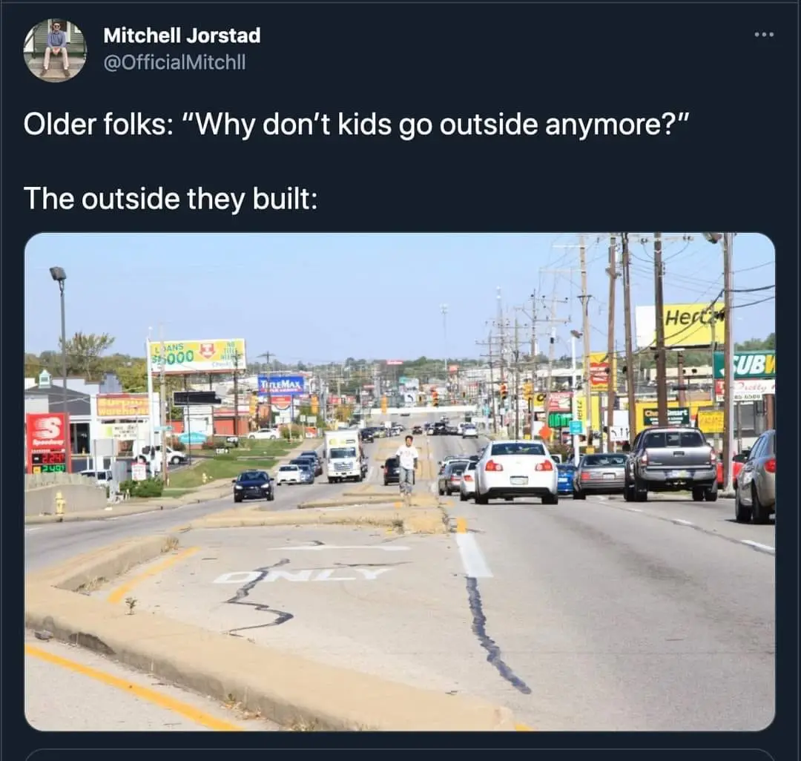
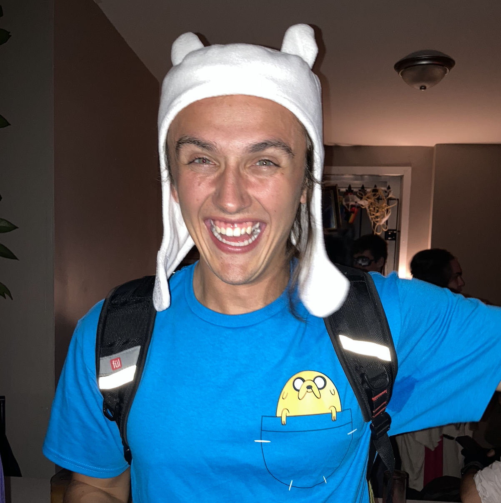

### 10/26/2023 The first post so you should probably read it...
Okay bear with me and let me get some stuff out of the way. Right now I’m writing on a Google doc. I don’t have a place where I’m hosting and sharing this blog for all to see yet, but I will soon. You would think I would have thought about starting a blog for a long time, but it's actually quite the contrary. So far, a blog has been a fleeting idea in my life, however I have a lot of confidence that this will be great for me, and I’ll remain consistent. I already consistently journal everyday with paper and pencil, although that does come in phases. If I go crazy here at my offic job I'm sure as hell going to document it.

For a while I've been journaling for therapeutic purposes. Months and months and months. I have entire books. It helps me, and I bet it would help you. (If you don't do it already.) I won’t get into the psychology of it. The only difference now is that it's for the public to see. Am I going to omit certain things since this is public? Yes... however, I’m going to try my best to not do that. To an extent. That extent being what I intuitivety feel to not say. I'll try my best to not hold back, besides obvious things like the numbers on the back of my credit card. 

I want to be authentic and personable here because I don’t think enough people are. I think it's time for my writing to be shared with the world. It's one of the greatest gifts we have as humans. 

There are a lot of people I look up to who are just everyday people. People in my life. Being with them gives me the same feeling I think I’d get if I’m ever hanging with one of my idols who are world reknown. I get very curious about their thoughts, their daily life, what they think about, etc. Mostly in the context of how they go about creating their music and art, or how they go about their craft, whatever it may be. I just want to pick their brain over and over and over again. I’ve been obsessed with interviews and sometimes it's hard to find stuff like that. So maybe I can start a trend. Everybody blogs. Maybe my brain will be the one someone wants to pick one day? If they’re the right kind of crazy. And then they’ll have this. Regardless I’m doing this for myself to a degree. Its for myself and the reader, but I will be unapologetically talking about my personal life and all the stuff I’m nerdy about. 

I have way too many thoughts that my body gets upset about. I think I can alleviate this symptom by getting thoughts on paper and screens. Curiosities finally shared. That’s what I realized being an artist and a musician is about for myself. It conveys those thoughts and feelings in a way that isn’t boring. In a way where someone can understand it more than words can say. Simply put, it just works. It just feels better to express. So sorry if you don’t like how I express myself. Or if it makes you uncomfortable. I guess maybe I’m doing it for selfish reasons.

Words still say a lot. Words are just one medium of expression, and can do a lot. I mean I’d argue that the invention of language is the biggest reason we conquered nature and got to where we are now as a species. But there is indeed far more than language.

I’m so damn excited for this blog. I can already feel that it's been 2Long. We’re going to get INTO IT here. Philadelphia is my kryptonite in a good way. 

### 10/30/2023 Noise

[Mitchell Jorstad ](https://x.com/OfficialMitchll/status/1382709940352135175) via X (Twitter)

In my office at my desk there is this terrible noise ringing above my head from the rumbling of the central air system. It's very annoying, and not exciting to hear about I’m sure, but I figured Nardwaur could ask me about it one day. And I’ll say, “yeah, that was annoying”.

Thoughts like these make me realize that I really am crazy enough to envision a future like that where I’m living my dreams. Or what I mean is I’m crazy enough to think I can achieve them. However I often ask myself, “what else is there to do?”. I imagine one day I’ll find the right person, or people, and I’ll settle down somewhere. Somewhere pretty and quiet and I’ll just exist. It’ll be like changing from survival to peaceful mode. Hopefully I figure out how I can make money online, or all corporations just finally let us work from home. Whatever works, as long as it works. I’m so completely sick of the hustling and bustling of the eastern seaboard. The highways, and fast food, and office buildings, and industrial parks, and more. I am so sick of it. I can see why it's an economic powerhouse of the modern world. It's a machine that doesn’t stop running. It runs on human lives. It won’t have mine. 

Do I need to relax? I think becoming comfortable too early in life is what dooms most. 

### 10/31/2023 Adventure Time

(Me as Finn the Human at Chapter House on Halloween, Mikey baby got sick. I remember people kept going in Ben's room so he was using scotch tape to keep it shut.)

I am dressed up as Finn from Adventure Time today for our company’s costume contest. My two friends here are Marceline and PB respectively. 

Right now I feel pretty trapped in this job. I don’t feel like I have as much going for me as I would like to. All I know is it's good to save money right now. By now I wanted to finish the documentary for the Philly Stoop. I wanted to have my personal website up. I wanted my personal song “Kenopsia” and accompanying music video to be out. I still haven’t gotten access to Adobe creative cloud. I’m going to ask one of my friends who still goes to Temple to let me use their account since it's $100. At this point maybe I should just give into the annual subscription if I’m going to be all in anyway. I finished editing a YouTube video though. And I guess starting this blog is progress too. I need better internet in my house goddammit. I need that ethernet outlet dawg. Like please, I’m begging you. My PC can’t handle shitty Wi-Fi. I should just buy a Mac. 

When I get home I need to rest because I will NOT miss Julie at the Ukie Club. I am coming down with a cold atm and I’m not too pleased about it. Maybe it's because I’ve been going to the gym too much. I doubt they clean those machines thoroughly. It's nothing but water and sleep when I get home. Tunaween is tonight with Friend and Wallace, Tonight! and Disaster Artist. I don’t think I’m going to make it. I’m going to take some extra strength cold and flu or whatever the hell big pharma nonsense that will help me.  

Julie is a band that I look up to a lot. I'm inspired by them with my art and music in so many ways. They are probably in my top 5 modern bands right now. Class acts in whatever the hell you want to group them as. I think they’re aggressive but soft. They’re visceral and aesthetic. They definitely nailed their aesthetic. I love them. I’ll shut up now.  

Maybe I’m not as good at blogging as I think I am? Like isn't this a diary or what?  
