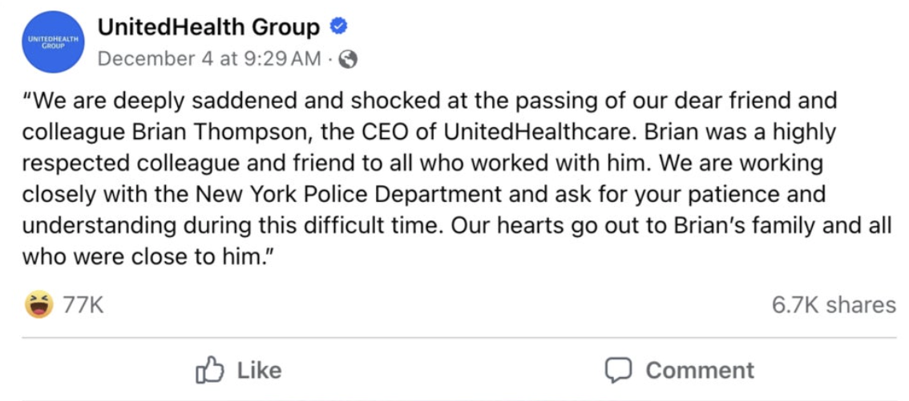
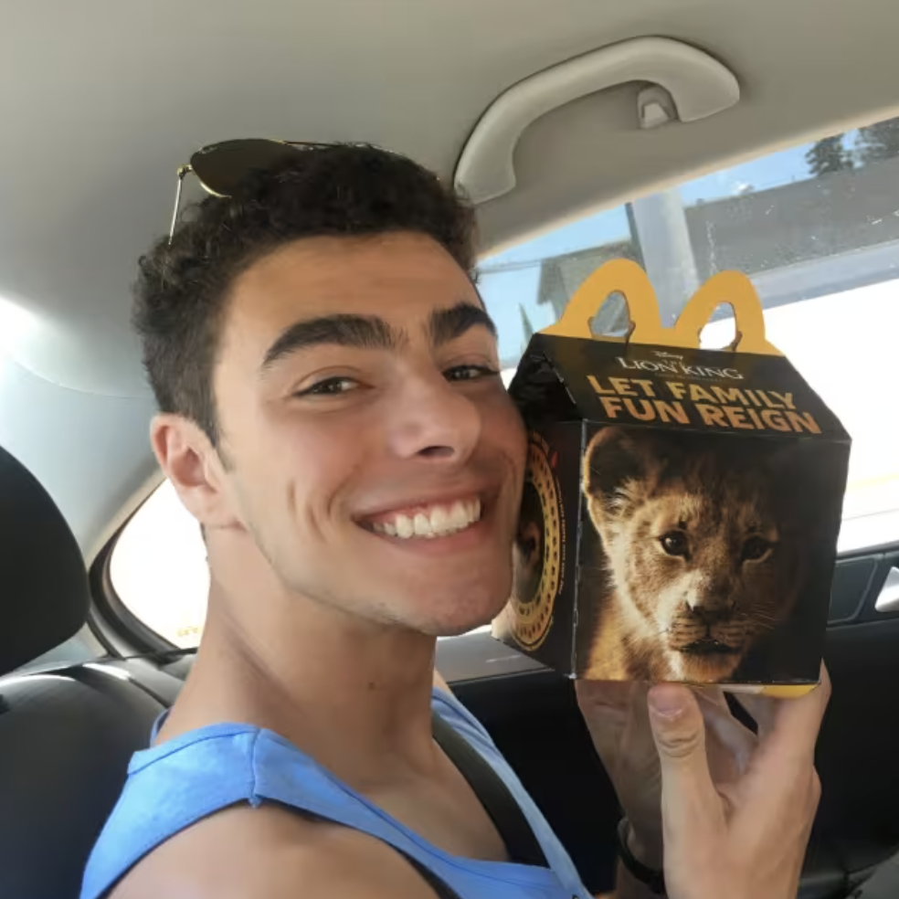
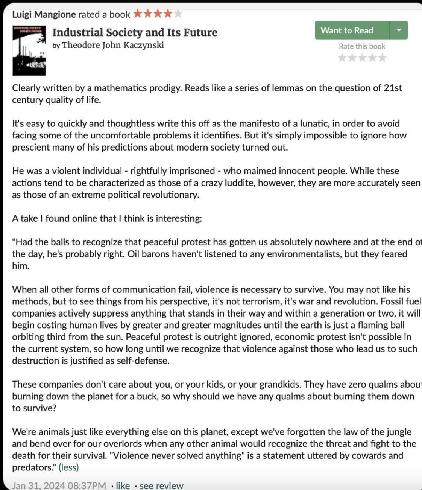

### Convictions

I wanted to talk about the recent occurrence of the fatal shooting of United Healthcare CEO Brian Thompson. Or more specifically, the now major suspect in question Luigi Mangione.

It is not confirmed if Luigi did it, it “appears” that there is a lot of evidence stacked against him at the moment. I must mention that the way he was caught and the evidence he had on him was very suspicious. Everything about him tells me that he is not a stupid person. I don’t know how so many pictures of him are appearing, but that’s not usually what happens when these kinds of things go down. 

Nonetheless, he has been arrested, and he is now the primary suspect in this case. 

I want to make stuff when I feel extreme convictions to do so. I’d be lying to myself if I haven’t been having a lot of strong feelings and opinions that are resurgent and resonating from the core of my being because of all this.

I feel for the CEO’s family, but I truly don’t have any empathy or care for him. I don’t care that he got killed or for the way he got killed. 

My point here, however, is that it upsets me that I feel this way. It upsets me that I don’t have empathy. Not only upset about myself, but everybody else who feels the same. The like ratio on UnitedHealth Group’s Facebook post announcing his death is enough proof that it's is true.  


I decided over a year ago to stay away from mainstream media as much as I can. However this incident has been a painful reminder that we don’t live in a healthy society. My worldview from my bubble is not the world. No society is perfect; none ever will be. This universe we live in will never be perfect. I’d argue that that’s what’s beautiful about it. It’s likely the main reason it’s even able to exist. 

When someone who is in a powerful position is targeted and shot dead in the street, and everyone’s reaction, besides the corporate media, is one of rejoice and satisfaction; it tells me that there is something very wrong. To me, it cannot be confirmed any more by anything else that there is something very wrong with the system, with our society’s morale, and where corporations stand. 

(I’d also like to add that the contrast between this case, and the one of the 26 year old choking out a homeless man is astounding.)

I think it might be true that there is nothing but soulless out-of-touch-with-reality individuals at the top. The people that have the most wealth and power are like that. Sociopaths, narcissists, and psychopaths win in this game of “see how much money you can make at all costs”, or “capitalism” for short. Currently money, and fame, but ultimately money, is the principal symbol of power. 

The world is not what I was taught to believe it to be. I don’t think most people are born evil, but those born into powerful families are taught very different things than the average citizen. They learn to adapt and survive in that elite sphere, which is a wicked world I’m unfamiliar with.

Brian Thompson was in that world, and that essentially makes him a leader, no? 

In our capitalist society, on paper, as the head of the highest profiting health care company, you are certainly leading. Regardless of his wealth, with that title, the proper thing to consider him as is a "leader" in our society right? Otherwise, what are higher up individuals in large corporations supposed to be? Making decisions that effect other people means that one has control over them, but the modern idea is that whoever got to that position got there because of good decision-making, conduct, character, etc.. That’s leadership. 

If we’re thinking logically about our capitalist system, as the most profitable health insurance company, it is to be assumed that Brian has become one of the best at fulfilling his responsibility to society in this respective field? UHC made more money than all their competitors because they served society the best. Or at least this must be true because they are a healthcare company. How else would they have earned this position? What else would they be trying to do? These lines become blurrier and blurrier the bigger a company gets. Its a process that I'd argue is inevitable. 

Even if CEOs don’t have all the say in their company, Brian surely had power and influence in modern society for the fact alone that he made 10 million dollars annually just from his salary.

I don’t like using the word “should”. But when I think about it, yeah, we should be upset this guy with a wife and kids got killed. This guy who has employees to manage. Perhaps Brian was really trying his hardest to make his company better at providing healthcare? (I’m not even trying to say that sarcastically. It's a shame I even have to even say this.) We should be outraged that he was able to get shot down and killed quickly on the street. We’d be outraged if that happened to anyone. We don’t condone murdering people. Right? Right everybody? 

So why are we cruel and uncaring to him? Why are we showing vague excitement about this? Why is it online that I see some of us are encouraging the act of murdering more CEOs? 

Well did you figure out why? It is not rocket science to any proletariet. Maybe you caught the answer already in my words. 

It’s all in the “we” here folks. It is not right vs. left. It never was and never will be. It is up vs. down. It is the millions and millions of hardworking blue collar and white collar individuals slaving away so that they may make a living, forced to do so because the wealth is NOT trickling down in enough fashion. Wealth trickling down can look like stopping inflation, not funding genocides, raising wages, more stimulus checks, literal wealth being passed down to others, etc, etc… You can only push a person so far. 

It's the secert underlying existential and dreadful problem in everybody's lives: the green paper. 

Quick rant.

When I and others use the words “wealthy elite”, do me a favor and in your mind don’t picture the rich neighbor who lives down your street. Don’t picture the guy who’s got two houses, four cars, and goes on vacations ten times a year because he got into a drop shipping niche. 

Those people are probably living well, but their wealth is nothing compared to the picture I want you to have. The picture of the people that have so much money they couldn’t spend it all if they had multiple lifetimes. The people with a net worth of billions. The people running the entire world’s show. The people making deals with tyrannical and oppressive governments for their resources. The people perpetuating deadly wars around the globe so the military industrial complex could profit. The people who are CEOs of the most profitable health insurance company at number 5 on the Fortune 500. 

Like Brian Thompson. 

I’m not going to name names for you. Because you already know some of them. Because it’s important to know that these people don’t operate in the shadows that they want you to think they’re in. They want you to fear them. But they’re made of the same flesh and blood, and they walk down the same streets you do. 

 ### We Need To Change The Idea of What Good Business Means

Making money is not always a sign of something beneficial happening. In fact the more money being made, the more likely this is true. Outsourcing all your manufacturing overseas to get your product made for slave wages is seen as good business. Upselling the price of insulin by literally hundreds of dollars is seen as good business. Using A.I. to deny more claims than your competitors, is good business. 

The people of the world can only stomach so much. People only want to participate in society if they think it is fair and just enough for them and everyone else to work for it. If you give people nothing to live for, they’ll have nothing to lose. 

With companies continuing to not be held accountable for actions that hurt society, when our justice and regulatory institutions fail us,  society will take the matters into their own hands more and more. 

### NYC

I was in NYC quite recently on a little day trip, and no I did not stroll by the Hilton December 4th with a vengeance. The blatant and obvious classism that was put on display in this city was very disturbing to me.  I saw all walks of life for sure, it’s why I have a love for New York. But since I’m not from there, it stuck out like a sore thumb. And also I will mention that I was only in Manhattan, so perhaps these observations are only about Manhattan. 

For example, I saw teenagers walking around dressed in outfits most people can’t afford. Right after that that, a block away, I saw an entire homeless family with little children. I don’t know if those kids were the oblivious type of ultra wealthy kin I unfortunately took them for, and I don’t know if that homeless family actually needed the help they said they did on their cardboard sign. The fact I can’t swallow is that both of these parties existed right next to each other. 

I’m not necessarily talking about those teenagers I saw when I say this, but the sense of benevolence I see in the ultra-wealthy is quite disturbing. They don’t treat and see humans as humans. I’m not sure if they even see themselves as a human.   

Online, the wave of class consciousness I’ve seen, and the paragraphs and paragraphs of people venting there horrible experiences with health insurance companies is so surreal. From now on, in political arguments, left vs. right, how about we always start here. From here on out let us start with our thoughts and feelings about the killing of the United Healthcare CEO, and why we all unanimously didn’t care and still don’t. 

### Luigi Mangione


I want to talk about Luigi Mangione. After I read all the information people have found online about him, I’ve concluded that he is 100% a sane person. In fact, he is a model citizen. High school valedictorian, Ivy League graduate, CS major, dedicated to personal development and working out, described as an articulate and compassionate person who founded and held a bookclub.

Whether he killed this CEO or not, his social profile conveys a lot of valid thoughts and convictions that can be backed up by factual data and well-acclaimed allegorical literature. 

A huge problem with our society's laws, with our human perception, is the idea of when things happen directly and indirectly. I’m going to get long-winded here, but bear with me because some people don’t actually understand this. 

___

Whoever actually killed this CEO, did this directly. By that I mean someone took out a gun and shot him until he was dead. There is 100% undeniable proof of this from camera footage showing the assault and death. 

We call this murder. As humans, when we socialize and survive together, we don’t tolerate that. We’ve agreed for obvious reasons that killing each other is not good. For moral reasons, logical reasons, obvious reasons right? Society and everyone in it agrees that we don’t like murder, and we don’t tolerate the act and the people who do it. 

However when the murdering happens, but isn’t able to be measured in a tangible way, all of the sudden murdering is fine. 

It’s okay. It’s allowed. It’s expected. 

All of the sudden when you and your loved ones are denied life saving treatments (if you can even afford health insurance) because of a new A.I.’s determination, well that’s fine. That’s actually great for business. 

Its business as usual. UHC is a multi-billion dollar company because what it does is “legal” under the current laws we have.  

We can’t measure how many people a health insurance company is killing because in the eyes of the laws we currently have, denying claims just means they’re not giving you money this time around. (Even though this is what we are paying them every month for.) 

It’s indirect. It’s legal. So as long as it’s legal, someone being denied can always be written off. It doesn’t matter whether they actually did or didn’t need the healthcare to survive or have a reasonable quality of life. They’ve decided for you. With their opinion. The people who aren’t even healthcare professionals. They decided that you do not get the care that a provider determined may help you. Care they determined WILL help you. 

I know there are a lot of other factors at play that go into financing healthcare. Just remember that the U.S. is the only developed nation without universal care. 

I think the only reason a health insurance company should deny a claim is if they think it is legitimately fraudulent. Besides the minority of cosmetic purposes, who the hell wants to get a surgery? Who would not just rather be healthy so they don’t have to waste their time and money?

More importantly, should we be letting for-profit and healthcare be in the same sentence? 

It’s okay to make money as long as it’s “legal”. 

### We’re Not Made For This World

So on the topic of change, I’ll say that we as humans aren’t biologically designed to worry about millions, thousands, even hundreds of other people. This makes one understand the actions of the wealthy elite and everyone else in general. 

Most citizens don’t spend their free time taking any real measures to change things, and they won’t be mad if you do the same. Most people want to enjoy the little free time they have when they’re not working. No one blames anyone for doing this because we all do it. The gems of human beings that would devote their lives to trying to enact widespread change are often the ones who don’t have the time or money to do so because they’re worried about financial survival. Sometimes even actual survival. 

The fabric of society is held together by our imaginations. The veil is thin. In fact, the veil doesn’t actually exist. 

So many aspects of how we live are backwards and misaligned with how humans work biologically, physically, spiritually, etc.. But that’s a topic I’m not going to chase at this moment. 

### Luigi’s Review of John Kacynzki’s Manifesto.

Luigi wrote this after reading the Unabomber’s manifesto: 




If you don't know who Ted Kacynzki is, look him up. 

I think if Luigi is the assailant, I believe he acted this way out of good faith. I think he did it from a place I can relate to. One desiring hope that a vile action can cause change that will better humanity. In fact it already has. Killing that CEO was a symbol FOR morality, not against it. 

I've never in my life seen a class consciousness spike as high as the one I've seen this week.

Murdering people isn’t productive. Murdering specific people however might be. Just ask the C.I.A. and U.S. military. 

Violence is and always will be a part of nature, and a part of our nature. It has its place. The media will make you think that throwing a brick through a window is an act of violence. They’ll make you think that whoever threw it is a criminal and must be detained and tried. 

I don’t see it as that. I simply see it as a symptom. A natural symptom to something bigger. The bigger thing being the true violence happening upon whoever through that brick. There is violence happening to them and it is the reason they were overcome by conviction to throw it through a window. They enacted direct violence as a result of indirect violence, but violence is all the same. 

Make no mistake, there is no difference between them. Almost all indirect violence is systemic.   

Here are some examples of indirect/systemic violence: 

- Diabetes manufactures (Eli Lilly, Novo Nodisk, and Sandi) inflate the price of insulin as much as they can get away with in America, but it’s indirect violence. So it’s fine. 

- Oil companies polluting the environment, and ravaging the earth so much so that the world will be uninhabitable in due time. But that’s not violence. 

- Nestle is responsible for horrific crises of obesity, nutrition, and water in the U.S. and around the world. So much that there is a whole community around it with 275k followers: [r/fucknestle](https://www.reddit.com/r/FuckNestle/) But that’s not violence. 

- United Healthcare rejected 32% of claims, over half the industry average, and made billions. But that’s not violence. 

I think Luigi cares about society more than most people. If it was him, it was because he didn’t know what to do to help society in the ways he wanted to. He didn’t believe his ideas were working, and saw this action as the only thing that can change that. 

If it was him, I believe that’s exactly what happened here. Unless things actually start changing, unless people believe they have a future, targeted acts like this are going to grow more common.

Luigi shared a lot of his concerns on his X (twitter), with his pinned post warning about the potenital for A.I.. He shared pieces of literature that address modern societal issues. He was not someone waiting for handouts. This link has all his tweets that you can view without going on X (twitter):

https://nitter.poast.org/PepMangione

Go check out what he spread awareness on and what he talked about. Think for yourself. I’ve read Brave New World and 1984. There’s a reason they’re popular in grade school education here in the west. Read them and think for yourself. 

Luigi isn’t some bum. He did everything he was supposed to as a young person, despite many health odds stacked against him, and yet he felt incapable of producing the real change he wanted to see. Change that a model citizen like him should have the agency to do.  

I just got his manifesto after writing all this. Here it is:

___ 

“To the Feds, I'll keep this short, because I do respect what you do for our country. To save you a lengthy investigation, I state plainly that I wasn't working with anyone. This was fairly trivial: some elementary social engineering, basic CAD, a lot of patience. The spiral notebook, if present, has some straggling notes and To Do lists that illuminate the gist of it. My tech is pretty locked down because I work in engineering so probably not much info there. I do apologize for any strife or traumas but it had to be done. Frankly, these parasites simply had it coming. A reminder: the US has the #1 most expensive healthcare system in the world, yet we rank roughly #42 in life expectancy. United is the [indecipherable] largest company in the US by market cap, behind only Apple, Google, Walmart. It has grown and grown, but has our life expectancy? No the reality is, these [indecipherable] have simply gotten too powerful, and they continue to abuse our country for immense profit because the American public has allowed them to get away with it. Obviously the problem is more complex, but I do not have space, and frankly I do not pretend to be the most qualified person to lay out the full argument. But many have illuminated the corruption and greed (e.g.: Rosenthal, Moore), decades ago and the problems simply remain. It is not an issue of awareness at this point, but clearly power games at play. Evidently I am the first to face it with such brutal honesty.”


He said it first, at this point “it is not an issue of awareness…”. I agree. I think that given all the media everyone’s been forced to swallow in the 21st century, you either have the awareness of the true evil that exists, the actual evil that plagues our world, or you don’t. 

Most people do though. Most people are aware. Again, it’s why no one cares about this CEO. It’s why everyone hates most corporations. It is either simple math to someone as to why this is, or you’re they're lost.  

### Why I Don't Care

I’ll be honest folks. I want to tell you the reason I don’t spread awareness on political and social issues anymore. The reason I almost didn’t vote this election. The reason I don’t go to protests. The reason I don’t use what little platform I do have to try and jumpstart social change.

I’m going to tell you why, and I bet it’s why many people like me are the same. 
I see a lot of people on social media who are politically charged. And I’d say I feel just as charged if not more than them. But not politically speaking. 

Democrat vs. Republic politics have long been a joke to me, secretly being America’s real pastime. I try my best to not ever pay attention, except for when I laugh at the absurdism of the presidential debates for entertainment purposes. I do think our government can make real change happen if those in our government acted in the true interests of their constituents and country, and weren’t corrupted, or blackmailed into obeying. 

``` Power tends to corrupt and absolute power corrupts absolutely.```

Stimulus checks were real, progressive amendments have been passed, but I don’t ever tell myself that they’ll be reliable when the real sh*t hits the fan. In my eyes they’ve already failed us. It’s too late. The silver lining of Trump to me is that I think he'll speed up this collapse. 

Insurance companies alone have spent over 100 million dollars lobbying.

Overall our species fails to see distant existential problems because their consequences aren’t happening in the present. We’re designed to adapt to problems as we face them. We’ve planned and prepared for a year ahead at most, not decades or centuries.  

Corporations and bad actors have sunken their fingers into politicians, and they make sure they don’t dare make drastic changes to their systems. 

What I’ll say though, is that I am charged in general. 

Deep down I always am, and I think I always will be. I refuse to sink into a life of ignorance where my soul’s subconscious begs to have its sins purged. 

It’s not right and left issues. Most policy discussion fodder to me. Not that I don’t care about women’s rights, or trans rights, or the border-crisis, etc. I voted for Kamala Harris mainly to protect women’s rights to abortion. I care, and it’s obvious to me who around me also does. I am part of the lgbt+ and although I wish the world was more understanding and accommodating, lgbt+ concerns are far from the forefront of my mind. It’s not that I don’t care, I care a whole lot, but in my mind we’ll get to them once more pressing problems get fixed. 

The problems with the powers that be. 

If only we can learn to handle them one at a time. 

You see, because of technology, so many people have finally been given agency to talk about social problems not talked about before. This has given all kinds of minority groups a chance to speak up and have more agency than ever before. I fully support that and encourage it. I mean who wouldn’t?!

The elite at play aren’t entirely stupid though. They have control and influence and teams of people helping them combat class consciousness. 

They know this would happen with modern technology, so they make sure to control all major communication/media platforms as much as they can. It's why not a single major media outlet is addressing the morale and ethos of the American people following this killing. 

They are bought and sold. If you pay attention, for once FOX and CNN are agreeing on something. Because they represent their corporate and wealthy owners. This should disturb you. 

 They control these outlets so that they can continue to convince us that our neighbor is to blame for the injustice and decay that’s happening before our eyes and not them. This brainwashing is rampant everywhere, on most platforms to some degree, but is the most prevalent on mainstream media outlets, and top social media sites. It will never work in the long run, but they’ve been buying themselves time while everyone is amusing themselves to death and distracted by nonsense. 

So no, I don’t make posts or stories anymore about atrocities our government makes. Especially when they’re on the same sites that give me an ad for Wendy's right after I post something. I'm sorry not sorry. 

I don’t go to protests, I don’t keep myself constantly informed on global, national, or even local news. I don’t do these things, because I don’t think they do anything but waste our time. I don’t think it brings about the real change we need.

Awareness is good, but like I said I've seen enough to know. I know other like-minded people are spreading awareness for me and I salute them. 

I think it is more productive to do other things. To focus on yourself and your community. Become the best you can be, so that you may be the best “you” to help others. Do things you enjoy for yourself. Give back to others. Do things because you want to, and not for money. Do as much of those things as you can. No one is here forever.  

___

Ultimately, I believe the actual change we need to survive as a species will inevitably begin someday in my life time. I believe it will come in the form of direct violence. I will always wish I was wrong. I will always wish that the optimist in me was right, and not the realist. 

Deep down I think most people know that shocking acts like this make the impacts we want and need. But few people do it because they’re scared of dying, facing a lifetime in prison, and worrying about their loved ones, including myself. I wish the world wasn’t like this because deep down I know it doesn’t have to be. 

We lie to ourselves and say that the consequences of inaction won’t come to fruition, but one day they will. And we’ll wish we would have done something. 

I do not condone violence, but if someone else decides to carry out a form of it, just remember:

` Boardrooms, not classrooms. `

Now get back to work!

