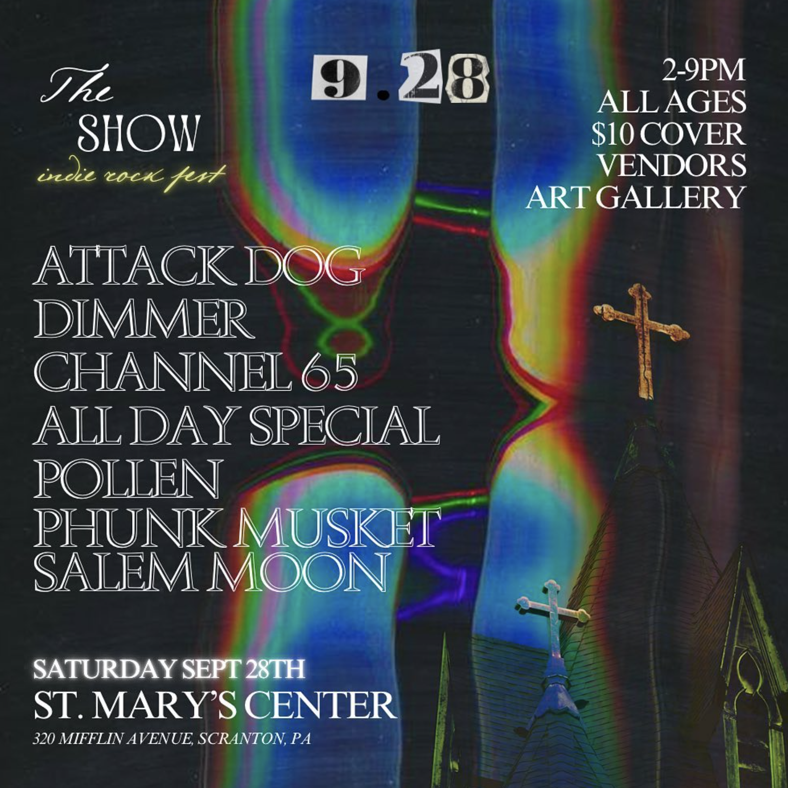
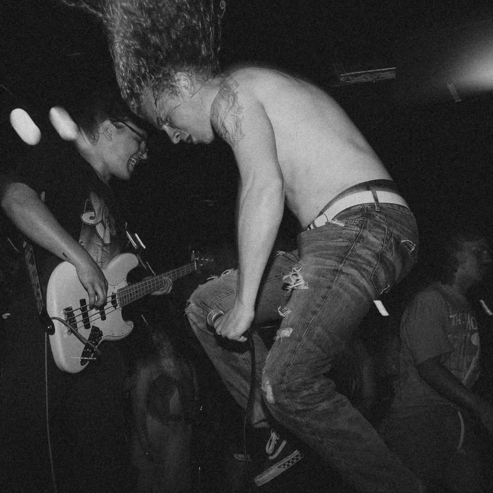

### Intro to Scranton

What is the Scranton Scene? What do I mean when I say that? Why I am of course referring to the diy/underground music scene in the lovely northeastern Pennsylvania city of Scranton. 

For those of you who don’t know, I am actually from the city of Scranton. I grew up around the area in a place I describe as "where the country meets the suburbs", or something like that. It's home, and I’ve grown to appreciate it more. Even though the weather can get rainy and cold as f**k.

While home for the holidays this past November I shot a music video for one of my favorite local indie bands “Pollen”. I consider these guys my homies as they have proven to be absolute lads. Other than shooting the music video, which I’ll get to in a sec, I had the pleasure of seeing a delectable show at the River Street Jazz Cafe in Wilkes-Barre. 

All of these happenings around Scranton made me think to myself, “Hey I know quite a bit about the Scranton scene, why not talk about it?” So here we are. You're reading it. Cool.  

As a disclaimer this is not an objective view of the scene. This is just what I’ve come to know and map out from my perspective and experiences. I’m kind of just rambling folks. 

### Pollen

So as I said a moment ago, while I was home for the holidays I shot a music video for [Pollen](https://www.instagram.com/pollen.music/). I directed it and got all the footage I’ll need. Now it's just time to edit. Music videos take a long time to edit. The boys in Pollen kind of let me do what I wanted, so some main goals with the video for myself were to try and see if I can shoot a long uncut shot, and also try out recording to my family’s old video cassette camcorder. My homie and bass God [Jack](https://www.instagram.com/janson.vhs/) has got the convertor jawn.

I recently pulled the trigger, and bought the full version of Davinci Resolve for their first ever black Friday deal, so I might take my time to make sure this video is a masterpiece. Also shoutout to Jackie and [Gariepy](https://www.instagram.com/gariepy_/) for being in the video. Thank you guys.

What’s the deal with Pollen? Do I even like them? Will they ever figure out its me who leaked their CC numbers and SSNs?

I call them the Scranton supergroup because they have musicians that all play in other notable bands. They got Albert from [Bullied by The Elderly](https://www.instagram.com/bulliedbytheelderly/) on guitar, Timmy from [All Day Special](https://www.instagram.com/alldayspecial69/) on bass, Ian from [Channel 65](https://www.instagram.com/channel65pa/)  on drums, and Caleb from Texas. And no not Texas the band (I don’t know if that exists), Texas the state. I swear this dude came out of nowhere. 

Caleb plays guitar, is the lead vocalist, and is their signature songwriter. From what they’ve told me, Pollen’s music comes from a wide selection of songs that Caleb has written during his youth. I hope I’m allowed to say that. Is that supposed to be a secret? Anyways, they’ve recently put out a new record “[Coy](https://open.spotify.com/album/3HoBZQIyMp1bOJcfeBt4uN)”, now streaming on all platforms. Everything was recorded and mixed by Albert in his home studio where, funnily enough some parts of the music video were shot. The music video will be for their song “Feud”, and as for a release date, let’s just say I’m hoping to finish it before the end of the year.  Ultimately it'll be up to them.  

But yeah I love when I get the chance to play with these guys. Ian is an absolute unit on the drums, Timmy embodies the musical spirit and prowess of Flea, Albert is a true diy connoisseur and madman, and Caleb is a chill & passionate frontman who knows how to write good a** songs. 

Okay, I’m done gassing them up now. Just go [listen](https://open.spotify.com/album/3HoBZQIyMp1bOJcfeBt4uN) to them. 

### SHOW RECAP 2 | River Street Jazz Cafe. 

I saw this show last Saturday at the [River Street Jazz Cafe](https://www.instagram.com/riverstreetjazzcafe/) with If Kansas Had Trees, Joe Burke and Co, Rosary Guild, and Esta Coda. 

The only band I was familiar with from this bill was If Kansas Had Trees, and I was very excited to hear them live for the first time. I met Maddux and Stone at a [Fosh](https://www.instagram.com/fosh.band/) show a little while back and we got them on the bill for “The Show” I mentioned earlier. (Unfortunately the date couldn't work out for them.) This time I finally got the chance to meet their frontman Joey, who was super friendly as I expected. He pours his heart out, especially on their new album "[Where You Thought You Would Be](https://open.spotify.com/album/38j0bsTgTymzXBdxfneVpt)". 

They sounded awesome live. While watching them I loved how tight they were, how on pitch they were, and how they matched their music’s energy. I look forward to their future. Something wicked cool is they’ll be playing with [Hot Mulligan](https://www.instagram.com/hotmulligan/) and [Tigers Jaw](https://www.instagram.com/tigersjaw/) for a little weekender at the end of the month. Go to the “Ho Ho Hot Mulligan” shows if you’re reading this and live near Detroit or Michigan. 

The other bands I was unfamiliar with but they were all nice surprises. 

[Joe Burke and Co.](https://www.instagram.com/joeburke_co/) to me was as pure as they come as far as singer/songwriter music goes. They were moody, but also remained upbeat by retaining a lot of pop structure in the songwriting. It was easy listening. Joe Burke surely has his heart on his sleeve, and on his vocal cords. I was geeking out over their cover/rendition of ‘Walking on a Dream’ by Empire of the Sun. They slowed it down and played it more acoustic, letting the lyrics ring out even more. That was exactly how you do a rendition. 

[Rosary Guild](https://www.instagram.com/rosaryguild/), I must mention, had some of the nicest looking equipment I’ve ever seen. They had a beautiful and shiny orange Starcaster and a glittering telecaster. I wanted them. Why yes I did indeed. However, having good gear doesn’t mean you know to use it, but fortunately this didn’t apply to them. These guys may have captivated me the most, and that would likely be due to the fact that listening to them made me reminiscent of Radiohead. They painted a deep and rich soundscape with harmonies and synths that put me straight into my feelings. I’m very thankful that they have a record out so you can check them out. Go listen to [Fauna](https://open.spotify.com/album/6TjVMF1tUipoFSWn2y7QEJ). 

Okay, I lied a bit. I did hear some buzz about [Esta Coda](https://www.instagram.com/estacoda/) through the grapevine long ago. They were good, and they proved that these last three bands were seasoned veterans of their craft. The last three bands all appeared to be friends, with Esta Coda having some of the same vocalists and musicians from the prior two bands come on stage for some songs. (I believe the guitarist may be in both bands.) If I had to bet, this appeared to be a “homie” show for them. The lead singer of [University Drive](https://www.instagram.com/universitydrive/) made an appearance and sang some of the songs with them. (I think their lead singer actually got sick? Don’t quote me on that.) These guys had a very warm vibe, and had the lighthearted stage banter I’ve only ever seen once before when I saw Panchiko. It was a swell time for sure. 

Also props to the sound guy at this jazz cafe for making this night exceptional. 

### Wilkes-Barre

Even though this is supposed to be about the Scranton Scene, I can't do it without mentioning Wilkes-Barre as well. Its it's other half. They must go together, and they both enrich and compliment the other. It's where I saw the show I just talked about. These two cities are right next to each other and their scenes very much overlap in the modern day. Wilkes-Barre had, and still does, a notorious hardcore scene. I found this interesting trailer for a documentary called Pennsylvania Hardcore: https://www.youtube.com/watch?app=desktop&v=9X4i4B4ccTw 

I didn’t see a hardcore show while I was home, but it’s worth mentioning. Some big bands have come out of Scranton and Wilkes-Barre and the wonderful hardcore phenomenon around this town is a big reason for that. Shoutout to VFWs. 

### Scranton Punk Co

I felt like it is essential for me to mention Jess and Rae Meoni of the [Scranton Punk Co](https://www.instagram.com/scrantonpunkco/) if I’m talking about the Scranton scene. The last Dimmer show of the year was set up through them, and we rocked Jess’s house in West Side for a benefit show alongside Pollen and [Salem Moon](https://www.instagram.com/slmxmoon/). Salem Moon, who I unfortunately didn’t get the chance to see that night as they were on first. Luckily, [Direct Action United](https://www.instagram.com/directactionunited/) recorded all the sets from that night, and I've also seen Salem when they played "The Show". They are one of my favorite upcoming bands. I'm interseted in what they'll do next.  

### Fests

Before I forget, last September I set up a diy festival by partnering up with [Kayla Grezch](https://www.instagram.com/kayla.grzech/), a local concert photographer and vocalist in [Look Back Luna](https://www.instagram.com/look.back.luna/). We set this up at St. Mary’s Center in the heart of Scranton. We called it "The Show", as I keep referencing, and it was a complete success. I was ecstatic that I got to curate a bill like that. We 100% plan on putting it on again next year and making it an annual thing. There are a bunch of photos and videos on the show's ig ([@theshownepa](https://www.instagram.com/theshownepa/)) in case you want to see what you missed.  Kayla, thank you again for handling the social media and making all the flyers and content. Go follow us so you can get updates on for next year!

There are two other notable fests in Scranton that I'm aware of. One is the one and only [Good Things Are Happening](https://www.instagram.com/goodthingsfestpa/) fest which is helped put together by Scranton Punk Co, and which got [Wicca Phase Springs Eternal](https://www.instagram.com/kournikovax/) to headline this past year! I’ve been wanting to go for the past two years. It happens outside at the giant Scranton Iron Furnaces, and they’ve got a really cool website: https://goodthingsfestpa.com/.

The other one is [NEPA Horror Fest](https://www.instagram.com/nepahorrorfest/) that happens at the Circle Drive in Theatre that has punk bands and a meet and greet with actors that were in iconic horror movies. I always found this fest to be a truly unique and special one, and it's also curated by Scranton Punk Co as well. 

### Venues

The most popular venue I’ve heard from word of mouth is in the heart of Scranton. It's called the [V-Spot](https://www.instagram.com/thevspotbar/). It's just north of downtown and allows for some of the best live sound I’ve heard. However if I found a genie lamp, I would wish they had more room. 

I would also wish for two more genie lamps. 

Another one is [The Ritz](https://www.instagram.com/the.ritztheater/). It is a renewed theatre venue downtown, but as of now I'd say it's far too expensive to book if you’re a small band just starting out. That is unless a bigger band let's you open for them. 

There is also the [Keystone Stage](https://www.instagram.com/thekeystonestagellc/) in Olyphant as well which is great for open mic nights if you’re just starting out. From conversations I’ve had, Scranton needs more diy venues as the scene appears to be growing. Not that I haven’t heard great praise about [Jared’s house](https://www.instagram.com/jared_jackie_/), but the more the merrier in this situation. 

### Speedrun

Okay let’s treat this like a speedrun and wrap up this post already. 

I ought to mention [Kayla Grezch](https://www.instagram.com/kayla.grzech/) again as I said she helped me out immensely with setting up “The Show”, and it honestly wouldn’t have happened without her. But also, she truly is very active in the scene, doing a lot of concert photography and singing in [Look Back Luna](https://www.instagram.com/look.back.luna/). They have been releasing quite a bit of music recently, so go check out their emo indie rock nonsense. (Their words not mine.)

Another concert photographer to mention is [Dom Kozuch](https://www.instagram.com/domkozuch/). Their photography is very colorful and saturated. I hope to catch them at a show sometime and I hope they keep up the shooting! Not the gunshot kind! 

[Channel 65](https://linktr.ee/channel65?fbclid=PAZXh0bgNhZW0CMTEAAaZGVnF7T5Ew_QwraficLDJEd5rRAlQoBtWnzOe4P4wt7DjkdHB3x29Alwk_aem_sMLAV1sPKCf-S2wUEqRRlQ) is an indie outfit that Ian from Pollen plays in. I made this music video for there song "Lil Buddy" you can watch [here](https://www.youtube.com/watch?v=qmxv1EqZhEA). Song goes hard and always will. I hope they keep making heavier stuff because if they do I’m here for it. Ian, Hunter, and Spenny have my full attention. 

[All Day Special](https://l.instagram.com/?u=http%3A%2F%2Flinktr.ee%2Falldayspecial69%3Ffbclid%3DPAZXh0bgNhZW0CMTEAAaalAQL3R7syx9wNooe4vQ8t0x4DAjLOkA_P7jeNUtVnh_CfAETvVI7qTKc_aem_8N0IAyjsnftqJr6u0dIh9w&e=AT1bPSsD_FmycfK1oQ_GC_Eampfixks5rVirasLWgsfmkeURYez2t0p0or7C-lEmJwJ_gk-rwMCtWLY2QwRreoiIbC24-epQ5HMYmJA) is a must see live band as their frontman Jack loses his mind and body to the music and belts out every word straight from his soul. As I mentioned earlier this is the band that Timmy from Pollen also plays in. Go check them out. They have music out, and the aura is off the charts. Seeing them live was a spectacle to behold. So see them if you want to move irresistibly. 

[Bullied By the elderly](https://www.instagram.com/bulliedbytheelderly/) is Albert’s garage rock band with some of his homies. They released a new project this year called [Sonic-Infringement](https://open.spotify.com/album/2yb9mwMKCP8OdRYwI0ekoS?si=xCSIUB1BSXiDyFaeSgFmSg&fbclid=PAZXh0bgNhZW0CMTEAAabvYDXLhzzQIgHgLlGpLlkBz4yUT5ONiPl6T1uYCahMofiU_WWpgCkqYRE_aem_RrodVZWDqqTC8OXW3I8diw&nd=1&dlsi=a0a01bb67cbb4da2) that’s got a lot of great psychedelic stuff happening. I think the album cover here matches the music perfectly. It's some feel good rock with great harmonies and lots of cool ideas. I’m sure they dream for the return of their vocalist Kara, but regardless I hope they keep up the good work. 

[Delaware Ave](https://www.instagram.com/delawareave.pa/) is another local band I’ve been trying to see for a minute. They're the only band on here I'm talking about that I haven't seen live. I was on a bill with them once when they went by "The Crates" but the venue ended up not working out. I wanted to briefly talk about them because I used to work with their frontman Chris back in highschool. I haven’t seen him in person since then, but I have no doubt that I will eventually. I mention this because I think this speaks to the power of music and how it brings people together. They also released a new single that your [Kids Are Gonna Love](https://open.spotify.com/artist/6vsGhhli4JIRqC6ecEj1wo).

[Wild Red](https://www.instagram.com/wildredsounds/) is another pop punk/post hardcore group from Wilkes-Barre who I’ve mentioned on this blog [before](https://g-snipes.github.io/blog/2023/november-backlogs/). That guy Jonah doesn’t stop. 

Man I didn’t even get to mention [James Barrett](https://www.instagram.com/jamesbarrettpa/), or [Pucker Up!](https://www.instagram.com/puckeruppa/), or [Petal](https://www.instagram.com/petal_pa/), and so many more! I think I’ll have to write part two to this post sometime in the future. It's impossible to encampsulate a scene in words. You got to experience it for yourself. Likely when I’ve been exposed to more of the Scranton scene, I can go into more depth next time. I’d like to give the bands, photographers, promoters, venues etc. the proper credit and write up they deserve. 

All this stuff takes a lot of time. Setting up shows, making music, editing photos, networking... its all a lot of work and for the most part, there's no financial incentive. Any city’s scene is a never-ending rabbit hole of names and faces, and musicians and their side projects. I feel like blog posts I make like these are becoming straight journalism at this point. I know this is my blog and I can do whatever the heck I want, but I think if I'm going to do this I want to do it right. Get better and better. Especially since I'm  putting them out there more now. 

My spider web of knowledge of the Scranton scene is mine, and I'll reemphasize that its not an objective reflection of the scene. I’m saying this to prevent someone from Scranton, who I didn’t mention, who gives their life to this shit from punching a hole in their wall. (But I'm also still learning to live with the fact that not everyone is going to like you.)

Overall I think a lot of these Scranton/Wilkes-Barre bands have deep roots with classic rock, but the more I hear them make music and stick together, the more I can sense the modern influences slowly seeping into their new creations. 

The internet is a wonderful thing. There has never been a better time to be an enjoyer and maker of music. I’m excited to see this scene grow. 

I hope you enjoyed the read, I’ll see you next time. If I mentioned you, let me know what you think of this perhaps? I am looking to improve this stuff. 

Also, totally optional, but you can buy me a [Ko-Fi](https://ko-fi.com/gsnipe) if you’d like to support. 

Peace <3

Channel 65 balling up via there [IG](https://www.instagram.com/p/C_i1dqbRHWl/?img_index=1)

