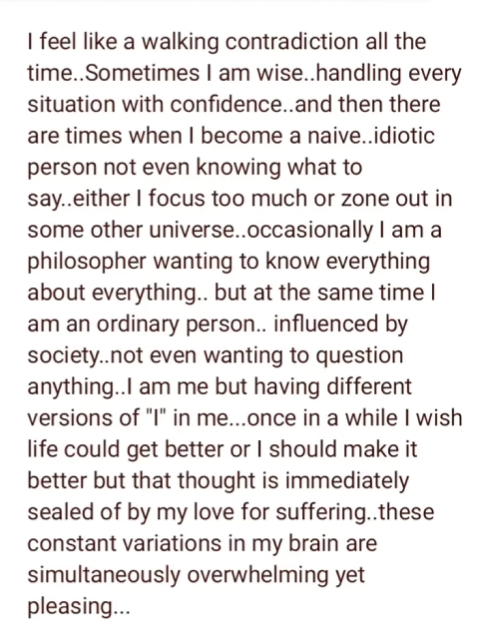

- This blog contains spoilers for the novel CRIME & PUNISHMENT.

### Why Did I Pick Up This Book? 

I don’t read very habitually, but I do tend to read novels from time to time. It’s better than an iPhone screen before bedtime. My roommate, who is a far different breed, can get through multiple books a week. That's the goal one day.  

This was my first time with Dostoyevsky, and the honest reason I decided to pick up and read *Crime & Punishment* was simply because I heard it was one of those must-read-before-you-die pieces of literature. It is an English teacher’s favorite. I’ve read other books in a similar vein such as *1984* and *Brave New World* and I had some ideas of what those books were about before I read them. I had little to no idea what this book was about, and although *1984* was utterly disturbing, nothing could have prepared me for the journey which is *Crime & Punishment*. 

Am I being dramatic enough? 

All I knew was that it was a fictional novel that takes place in 19th century Russia. I heard about it because Jordan Peterson praised Dostoyevsky often. I was never very fond of Mr. Peterson’s political theory, but I have gotten a lot of value out of his insights with psychology and theology. And this book is surely a study of the human psyche, told through its many characters and plots. 

Very quickly, I must mention that I wish Dr. Peterson stayed in his lane… Being a Jordan Peterson fan is enough to get someone cancelled nowadays, so let me just say that I think he has made too many mistakes and unsavory remarks, especially in his more recent career, for me to consider myself a fan.  

Anyways, as I said, I went into this book blind. So there I was, at Washington Square on a beautiful sunny day, sitting under a tree, and reading away, until suddenly I’m feasting my mind’s eye on the graphic depiction of our protagonist committing a violent axe murder. 

Yeah, it is that dramatic. Thanks for the mental scars Fyodor. 

“Oh my good God!” I say to myself as I nervously laugh. What did I just get myself into? How am I supposed to read another 400 pages of this story following a protagonist who is now a gruesome murderer? I found myself repulsed by his character and I wanted nothing to do with him.

This book was not easy to read, and I put it down for a while after reading the particular chapter with the murder. It was difficult due to its depressing themes and atmosphere, and also the lengthy and complex literature. I ask myself as I write this blog if perhaps I wanted to read this book to satisfy some stupid inner ego. To challenge myself. 

The truth is that *Crime & Punishment* is the exact novel the main protagonist Raskolinkov would seek out to read, and I hated the way in which this book held up a mirror to myself. This is why I want to discuss it with myself out loud. I am very glad I read it, especially at this time in my life. I think you’ll see why soon. 

### Let’s Get Into It

First, right off the bat, the main character of the story, Rodion Romanovich or “Raskolnikov”, has a lot of similarities to me and my own life. He’s 23 years old, an ex-university student, above average height, living alone, in a big city, and he wishes to make money to support his family although he can’t seem to bring himself to sustain a job. He’s suffocated by his own intellectualism and blinded by his pride and genius. On a dime he will fluctuate from being extremely altruistic to completely apathetic. He is depressed and neurotic as well, even before he committed the murders. 

Am I saying I’m an exact copy of him? No. But if it wasn’t obvious by me writing all this, I have given into the fact that I related and felt for his character very much. 

He gets the idea to murder a pawnbroker woman who is described as an old hag nobody in town likes. She’s known as greedy and rude. Raskolnikov’s idea is to kill her while she’s home alone, take her rubles and valuables, and use the money to finance himself to finish school and help his impoverished family. I also believe he wanted to start a law practice business as that was what he was studying at university. 

In the book, it says that he saw himself as a “Napoleon”, some great champion and leader, like the actual Napoleon Bonaparte or Alexander the Great. He saw himself as equal to these individuals. Someone who wouldn't hesitate for a moment to carry out a heinous deed if it meant the betterment of humanity. Even murder. 

Raskolnikov sees killing this pawnbroker woman as just that. He can save the world if he carries out this one simple atrocious act. He doesn’t think moral codes apply to individuals like himself. So, caught up in these superstitions of himself and the world that brewed inside his miserable isolation, he goes through with the murder (unfortunately he has to kill another innocent witness during it), and quickly realizes that killing these people also causes him to kill himself. He becomes mentally martyred. His old mind and his old self is gone forever. Blinded by an evantual salvation he doesn't take into account how this experience wouldn’t affect him. 

Saying he was out of his depth can’t even begin to describe it. He hides the little money he manages to steal, (he doesn’t steal much because he panics) and doesn’t even use it out of immediate guilt. The rest of the novel is spent following him through his new inner insanity and ultimate redemption. It follows other complex characters too, some who I’ll mention later. From what I’ve gathered online, it appears that everyone completely understands why Raskolnikov decided to carry out the murder and that by the end, after pleading guilty, going to prison, and devoting his life to the love of his life and to God, he is completely redeemed. 

### Superman

If you follow this blog you know it's been a little while, and you also know that my last blog post was about Luigi Mangione. I am very thankful for Dostoyevsky for showing us that any act of cold blooded murder, no matter a supposed justification, means that one is playing God. A role only fit for nature itself. Although we humans are nature, I believe that our highly developed consciousness has separated us from it. In the words of Rust Cohle: 

> I think human consciousness is a tragic misstep in human evolution. We became too self aware; nature created an aspect of nature separate from itself. We are creatures that should not exist by natural law. We are things that labor under the illusion of having a self, a secretion of sensory experience and feeling, programmed with total assurance that we are each somebody, when in fact everybody’s nobody.

I imagine that those carrying out war crimes are either psychopaths or have died figuratively as well. Does the hope for redemption mean we must do everything we can to capture and rehabilitate the war mongers of the world, or are they themselves the evils of Pandora’s Box that must be dealt with before we can see the hope?
_____

I want to admit a recurring fantasy I often have. I sometimes think of creating a graphic novel out of it, to turn it into something constructive, but often I just scoff at myself for having this fantasy at all. Maybe fantasy isn't the right word for it, but its a daydream of a reality where I suddenly gain the abilities of Superman. 

This part of my imagination is certainly fueled by my love for the show *The Boys*. With these new superhuman abilities I immediately fly and crash through the ceilings of the major government buildings of Washington D.C. The city’s defensive missilexs bouncing off of me like nothing. I softly touch the ground and demand the politicians and lobbyists to tell the public the truth. I demand they tell me who is acting the most corrupt. I demand they tell me who is blackmailing who. I give the U.S. and many powerful countries of the world deadlines to better their societies. To end wealth inequality, to have free healthcare, to prioritize quality of life and education… 

In this fantasy I usuallyx seen myself as the good hearted Superman, but I’m actually being a terrorist. I think I’m Daenerys Targaryen, liberating the world, demanding what I think should be improved with the threat of dragon fire. Would I really go through with hurting or even killing world leaders if they didn’t do what I wanted? Would I destroy precious infrastructure? Does obtaining Superman’s abilities mean I have to do something like this? 

In the comics Superman doesn’t get involved with world affairs, he just saves it from obvious things that cause it assured destruction. In *Man of Steel (2013)*, Superman never once intentionally kills anyone, friend or foe, until Zod has an innocent family cornered. We think of ourselves as Superman, but perhaps Alan Moore was right in suggesting that we’d be more like Homelander. Emotional. Erratic. Overconfident. 

Human. 

Do I know for sure that threatening a President with my glowing red laser beams will make the world a better place?

I now realize what that movie superhero movie *Sky High* was trying to say with its lesson:

>Just because you have powers doesn’t make you a hero.

I can't believe I'm quoting that movie.

Perhaps this blog is ultimately for those who do happen to have the most power. Too bad it's unlikely those individuals will ever read it.

I realize now that if everyone thought they are righteous to transcend humanity’s collective morals then we would quickly have a world of anarchy. Do I think murder can’t be justified? The Christian Bible allows “killing”, if another person is trying to murder you or someone else, but the butterfly effect of doing that is long and impossible to predict. All I know is that I am empathetic towards those like Raskolnikov and Luigi, (although Luigi hasn’t been officially convicted of murder) because what matters to me is the positive change I believe they had hoped would come about from their vile actions. 

### The Bloody Mirror

We have all entertained ourselves at some point in time with the thoughts of killing someone. Children play games all the time where they fight one another and act out dramatic deaths. It's in our nature. It’s in our games, movies, books, and news. Ask yourself, at what point in our imagination does violent entertainment turn into violent considerations? I think society sees violent thoughts as nothing but intrusive thoughts until an actual murder is committed. By this logic you’re either at a 0 or a 100. This leaves all the responsibility on the individual to decide when to seek help for themselves if their mind is unwell. 

Listen, I’m not talking about thoughts of killing someone because you’re a demented serial killer or have a sick fetish. I’m not making a point here on serial killer psychology. 

I’m talking about thoughts where you think if you killed the right person or people, at the right time, that it would benefit humanity at large. Exactly like Raskolnikov thought. If you “entertain” the idea of doing it, should that be considered a crime to be punished? I think if the government could read our thoughts they would very much punish it.

Have you ever thought about going back in time and killing Hitler? If you’ve never thought about killing the right person for the sake of others, ask yourself this:

If you were given a button which when pressed would immediately and painlessly kill Vladamir Putin would you press it? What about all the heads of Mexico's drug cartels? How about a U.S. President? Has this hypothetical ever crossed your mind? Would you press the button for any of them? Would you dare to be God? 

It might be in our nature to become God if given the option. How arrogant of a species.  

I guess it's been long overdue for me to watch *Death Note*. 

### Back To The Book 

Determining if someone is truly altruistic in their core, even if their actions are morally wrong, is a decision we all get to make within ourselves. I find it to be a determination we come to on a spiritual level. Of course I take into account what someone did on paper, but I look deeper as to what they meant to get out of it. What they wanted to start, or maybe what they’d hope to end. I never examine them by facts alone. I look into their eyes, I see what art they’ve shared, I learn about how they grew up, I try to feel what they have been going through. 

There is a cathartic moment in the book when Raskolnikov confesses his crime to a girl named Sonya, a person made of selfless love for her family and others. In an even worse financial situation, she never once thinks about murder or even stealing. 

If I were to be in the room with them when he confessed, I know I would have consoled him. I’d console a murderer, because through the inner monologues the author depicts, I found myself in him. I felt bad that his mind went where it did. I’d direct him towards the hope at the bottom of the dreadful box he opened.

_____

I might be getting long winded. This book is the best depiction of criminal psychology I’ve ever read. It’s a great testament against nihilism and how one needs God in their life. (Not the Christian God specifically, but true faith in the idea of one.) 

The conclusion I’ve come to with this novel is simply to be more like Razumikhin and less like Raskolnikov. 

Razumikhin is the foil character to Raskolnikov and follows him a great deal throughout the story. He’s a bubbly, cheerful optimist who although oblivious at times never goes into the realm of doomed ignorance. He can be annoying, but he’s always himself. He is struggling financially very similarly to Raskolnikov, but he doesn’t decide to kill an old pawnbroker because of it. He always tries to find logical conclusions and never assumes he’s being deceived or shown a false narrative. He is the least suspicious of Raskolnikov despite being with him the most and witnessing his maddening behavior. Out of all the characters, I feel that Razumikhin understood Raskolnikov the least because he can’t imagine someone being anything other than themselves, or living a lie.

I hate that just “being positive” time and time again is demonstrated to be so effective.

I fear that I know far too well how to be someone I’m not. I know far too well how to be like Raskolnikov. So this blog was a curious dissection, but also a confession of sorts. 

### Conclusion

I know exactly how to isolate myself and brood over absolutely fucking everything. Dooming myself and the entire world before I’ve even given myself or the world a chance. I’m 23 years old and I’m already being ageist towards myself in the things I want to pursue. I have been largely unemployed for the past year, because of my own will, clinging to morning workout routines the best I can to keep me from being ungrounded and messy. I find it far too easy to slip into unhealthy mindsets and behaviors, and far too hard to at the very least just be grounded and gratuitous.  
 
I threw myself to the fire believing that I could generate a decent passive income in a year's time.  I wanted and wanted, only to never quite get the discipline I needed, and the focus I needed to actually accomplish that. 

Look, I wanted to try new things to see what I liked and to see what’s practical. I made music. I started this blog. I tried stand-up comedy. I audited acting workshops. I talked to professionals in all kinds of industries and so much more. 

I wanted to try new things, and I’m glad I did, but as I mentioned, the end goal was to become my own boss and become financially dependent. 

Desire, desire, desire. I want, I need, I must have or else. Or else I’m a failure. 

Over the past year my desire for financial security obfuscated the truth and purity I wanted in my art, and even more importantly stressed me to the point where I couldn’t be in the moment during anything I did. It gives me this deep and lingering anxiety. 

I still believe I can do anything I set my mind to, but I still can’t make up my mind on what that thing is. The reality is that you must pursue goals one at a time, especially achieving expertise or proficiency at a craft, hobby, trade, etc. You can be anything, but it must be one at a time. (And you need financial support.) I can’t seem to bring myself to work on the same one thing every single day. I lose my balance constantly. Old fears and new anxieties feel anchored to my psyche. I can’t help but feel that I am what a modern Raskolnikov looks like.

I don’t want to feel superior to people. An undeniable aspect of my life that I see as objective is the fact that I have been dealt a really good hand. I graduated university with minimal debt with a STEM degree, I live in a city that is a hub for creatives, I’m young and strong and take care of my body. At times I am showered with compliments. I’m a cis white man. I have support from family and friends. I truly believe that I am the only thing holding myself back. I take responsibility for as much as I can, or at least I always try to take responsibility for how I reacted to a situation.

I have had much success over the past year, but it is so hard for me to see and feel that. Success isn’t linear and is defined by our own personal metrics. 

I constantly fear that I have all this potential and I’m wasting my time doing nothing “real” with it. I’d like to see real change in the world. I’d like to practice proper self-care. I’d love to stop hating myself so much and feeling like I’m just the most toxic person in the world. 

Okay, it's getting late now. What’s the final conclusion? Am I going to do something about all this or am I just going to keep venting? 

I’ll try to be honest folks. This world is brutal. My life feels like a huge mess lately and I think my ego can’t stand to admit that. It never has. This book sent me on a spiral that I think I much needed, but a spiral it was indeed. Isolation and loneliness aren’t good ingredients for a good time. But ultimately, I’d like to get better at sharing my feelings. 

I want to mature as a person. Need those good old constructive and healthy conversations with like-minded individuals. 

You’re not alone. 

~ IG: [@tortured_.me](https://www.instagram.com/tortured_.me/) 

 

