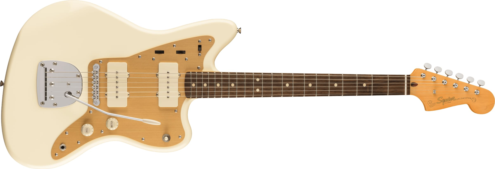
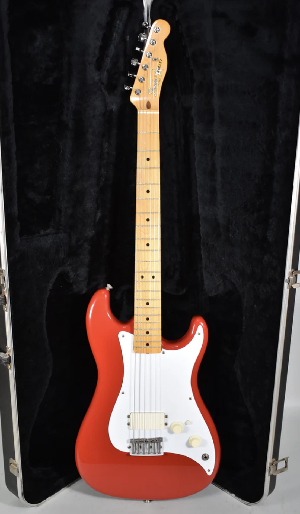
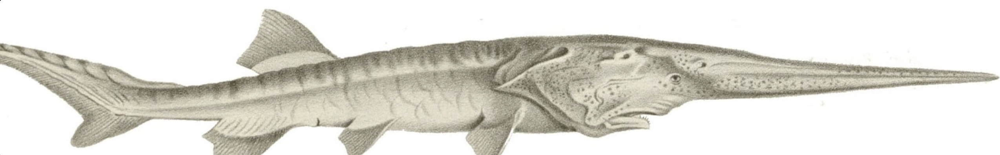

Below is my long conversation with the Philly/Connecticut diy trio [Microgoblet](https://www.instagram.com/microgoblet/). From my point of view this band seemed to pop up out of nowhere, bringing a unique and mysterious energy that I couldn’t quite put my tongue on. Instead of letting them become another victim of obscurity by my mind’s ideas, I decided to ask them for an interview. They politely agreed. So on a late weeknight evening after seeing a wonderful bill which was the [Walker Rider](https://www.instagram.com/walkerrider444/) show at *Abyssinia*, I made my way to their turf in West Philly to ask some questions, get some answers, and shoot the shit. Comprised of Luke Shroeder on bass (left), Adam Cohen on guitar and vocals (middle), and Myles Vincent on drums (right), Microgoblet let loose... in the chillest way possible. 

_______

*So I guess to start off...*
## Q1: What are your names and what instruments do you play? What's your musical background? 

**Luke:** My name is Luke Schroeder. I play the bass in Microgoblet and my musical background is guitar. Hehe. Now I play bass.

**Adam:** My name is Adam Cohen. I play guitar and sing in Microgoblet, and my musical background is bass. This is true. 

**Myles:** I'm Myles. I play the drums, and the drum set is the first instrument I have ever picked up, so my musical background has been playing that for five years now. 

*Cool. Are you guys all from Connecticut?*

**All:** Yeah.

____

## Q2: How'd this band form? 

**Adam:** Luke and I were previously in another band called [Them Airs](https://www.instagram.com/themairsct/). I played bass and Luke played guitar. That band got less active over time, and then I got dumped, and so I had all this time and I really needed to do something and Myles had been wanting to jam. So I started playing music with Myles all the time and we wrote a bunch of songs. Originally it was just the two of us but we thought it would be cool to also have bass in the band. 

**Myles:** We added bass probably about eight months after we started. 

**Adam:** Was it eight months? Was it that long? 

**Myles:** I think so, yeah. Because we started in October, and then it was in June. 

**Luke:** The first show we did bass was in June. The Little Red Library or some shit like that. 

**Myles:** But we started practicing with bass a little earlier. 

**Luke:** It was rough, because I'd never touched a bass before in my life. 

**All:** Hehehe.

**Luke:** Well, no, I noodle. I noodled. But, like, not like that. 

**Adam:** I didn't play guitar before this band. I owned it, but I never played it. I just played bass all the time. 

**Luke:** They played Porch Fest, and I could have played bass, but that would have been really bad. **chuckles*

____

## Q3: What is Microgoblet? 

**Adam:** Well, there is like the physical object. 

**Myles:** It's a little brass cup that we found in my basement at one of me and Adam's first practices and it turns out it originated from a doll set one of my ancestors made on my mother's side. I think it might have been her grandfather or great grandfather, but it's a little tiny bronze cup that's like one inch tall. We named it after that basically. 

*So it really is a micro goblet?*

**Myles:** Yeah, it's this one off object. A little cup. That I found.

**Adam:** It just seemed like a good band name. The songs are short. 

*I think it is.*

**Myles:** It just kind of kicked around on the floor in the practice room until it was like, well, there's that thing that we've nicknamed. Call it that. 

**Adam:** You're like, "that's a microgoblet." As soon as you said that, I was like, that's the name, that's the name of this band.

**Myles:** It was just a comment offhand. I was just using words to describe a thing I saw. Because it's a little abstracted like you know we could have called it small cup or some shit. 

**Adam:** Small cup, big water, vicious drip. 

**Luke:** Small cup, big water, vicious sip. 

**All:** Hahahaha.

**Adam:** Do you know the band [Small head, Big Torso, Vicious Grip](https://www.instagram.com/shbtvg.band/)? 

*Yeah.*

**Adam:** We're always like coming up with new versions of that.

*That's funny.*

**Myles:** Whenever I see Rowan, I just come up with like four variations of it. 
 
_____

## Q4: Some of you guys are from Connecticut and some of you still live there now, right? 

**Myles:** Yeah, I still live in Connecticut. They moved here last year. 

*So how do you guys make that work?*

**Myles:** I usually take the bus down once or twice a month and I stay for anywhere from three days to a week. When they're not at work we write and practice and do shows, so I feel its like short bursts of a lot of activity and that keeps it in shape like pretty good.

_____

## Q5: I saw you guys play at Silver Age HQ. So what do you guys think of that venue? 

**Adam:** I love [Silver Age](https://www.instagram.com/the.silver.age.hq/)!

**Myles:** We played there so much and we're going to keep playing there. We're playing there tomorrow. 

**Luke:** They're our neighbors. 

**Adam:** They're friends. Friends and neighbors. I like the way that they've set it up. It's very funny. They have a lot of funny stuff.

**Luke:** They have like an aesthetic.

**Adam:** Very quirky. 

**Luke:** But aesthetic. It's like a beautiful but funny house. I'd say. A gorgeous, silly house. With all the funny writings. There's something awesome when you're going down the stairs into the basement there. I forget what it says...

**Adam:** Also, Cole is very good at live sound. Like, probably the best live drum sound I've ever heard. We weren't playing, but it was like the last show that I went to there. It was, I think, the [Prance](https://www.instagram.com/thisisprance/) release show? And like, the drum sounded so good. 

**Myles:** The sound that's produced, it sounds like you're listening to a recording. Because they have them behind a plexiglass wall, but they're mic'd, so it cleans it out. And it's a little hard to play from behind the wall initially, but...

**Adam:** But it sounds good to the audience. 

**Myles:** Yeah, knowing what it's like when you're in front of it, it sounds great. It's like, that's cool. I'd prefer no plexiglass, but I get it at this point because I've seen enough shows there where I was like, oh, that sounds great, actually. I like that. 

### Microgoblet Fun Fact:

**Luke:** Is it like mad bright when someone takes a picture back there? You just lose the audience for a second? 

**Myles:** Oh, yeah. I don't know. I don't look up. 

**Luke:** Neither do I. That's a fun Microgoblet fact. 

**Adam:** I can't look up either. 

**Myles:** I just look directly at the snare drum the entire time I'm playing or at my foot. I don't look at the audience or the other band members. Sometimes I look at the other band members, though. Yeah. Like a part that's like... I need to kind of use telepathy to figure out where something's happening.

*You play by ear. That's what it is. Play by feel?*

**Myles:** Sometimes it really bites me that I don't look at anything when I play because I just, like, forget where a cymbal is or something. 

**Adam:** We'll, look at each other though, sometimes. I don't think any of us really look up when we're playing. I need to, like, look at what I'm doing. 

**Myles:** I think we look at each other to, like, check in or something? That's what I do at least. 

___

## Q6: What are some Connecticut bands that Philly needs to know about? 

*Speaking of... I see that you guys have a show coming up with [Pulsr](https://www.instagram.com/pulsr_/) at Mini Mart.*

**Myles:** That would be one of those bands. 

**Adam:** Yeah. That would be the band. I mean, pretty much, like... everyone's moved here, basically. I mean, or at least parts of bands have moved here. Like, even Pulsr. I mean Josh is in Philly now. 

**Myles:** Drew did for a period. 

**Adam:** Yeah, Drew. I mean, [P0rc3laine](https://www.instagram.com/p0rc3laine/). Like, Brenna moved to Philly. I guess bands that are like fully Connecticut bands that people should know about like [Wally](https://www.instagram.com/wallymusicusa/) 

**Myles:** Wally!

**Adam:** Wally for sure, although two of them are gonna move to Europe so they're not gonna be here for much longer haha. Connecticut is a place that you leave you know? 

*Lol.*

**Luke:** No offense.

**Myles:** Also, [Big Iron](https://www.instagram.com/thebigironsound/). 

**Adam:** Yeah, Big Iron rocks. 

**Myles:** Big Iron is one of the best bands. 

**Luks:** Even then...

**Adam:** Brian lives in Brooklyn. 

**Myles:** Brian lives in Brooklyn now. Okay, never mind. Who else? 

**Adam:** [Snowpiler](https://www.instagram.com/snowpiler/) and [The Knife Kickers](https://www.instagram.com/theknifekickers/) are the last two bands where people still live in Connecticut. And Snowpiler's entire lineup had to change. 

**Myles:** And [Sundots](https://www.instagram.com/sundots/). 

**Adam**: And Sundots. 

**Luke:** Oh, that's true now. That's back... Uhhhh [MGMT](https://www.instagram.com/whoismgmt/). No, I'm kidding. 

**Adam:** They're not fucking from Connecticut. 

**Luke:** I know they're not. I think they're Californian. 

**Adam:** No, one of them's like from New York and I think, yeah, maybe the other one's from California. 

**Luke:** And they cowabunga'd. 

*Oh, can I kill that cockroach?*

**Luke:** I thought I killed that motherfucker!?

**Adam:** Who else was left?

**Luke:** This is so sad hahaha. 

**Adam:** This is so sad. 

**Myles:** There's [Pilm](https://open.spotify.com/artist/0vn12fANedSqRJ579P6ISx). 

**Adam:** Yeah, there's Pilm. 

**Myles:** Pilm is a pretty good band. 

**Adam:** No, they changed their name. Didn't they change their name? 

**Myles:** They did. I don't know what it is. Was it a [dead doe](https://www.instagram.com/deaddo3/) or something? 

**Adam:** There's our friend Jonah.

**Luke:** Yeah, our friend Jonah DJs good. 

**Myles:** What's that new band with him? 

**Luke:** What's that called again? 

**Myles:** Sexton Hill. 

**Luke:** Sexton Hill. Which is... Actually... Yeah. 

**Myles:** I play drums in that too. 

**Luke:** I'll just say it's a place, because I want to keep that place a secret. Well, it's not really a secret anymore. Actually, it's under a different name. 

*I was going to ask...*

___
## Q7: During one of your live sets, someone named Jonah says he loves you. Who is he? 

**Adam & Myles:** That's Jonah. 

**Luke:** Wait is that that Jonah? 

**Myles:** What liveset was it? 

**Adam:** Was it at [the shop](https://www.instagram.com/theshop.ct/) in Hamden? 

**Luke:** Oh, at the shop in Hamden?! Yeah, that's that Jonah. 

**Adam:** We love Jonah. 

**Luke:** I've been friends with him since I was 13. 

**Adam:** May God bless him and keep him. 

**Luke:** I went to hang out with this kid in middle school, and then I didn't have a phone, and I showed up to the park, and he wasn't there...

**All:** Hahaha!

**Luke:** So then like my friend, my friend Jonah, well, he wasn't my friend at the time, but he like showed up and we started talking. He was like, "you want to go to Stop and Shop and get some monsters?" I was like, "hell yeah." And the rest was history. 

*So he does DJ?*

**Adam:** Yeah, he's good. 

*Cool.*

**Luke:** [Dr. Crode.](https://www.instagram.com/dr._cr0de/) 

____

## Q8: I heard a rumor that your single "French Exit" was an accident? 

<iframe style="border-radius:12px" src="https://open.spotify.com/embed/track/6NKZymSB32U7vxL3g5B01m?utm_source=generator" width="100%" height="352" frameBorder="0" allowfullscreen="" allow="autoplay; clipboard-write; encrypted-media; fullscreen; picture-in-picture" loading="lazy"></iframe>

**Luke:** Yeah, haha. 

**Adam:** I mean, ideally, we're going to announce it on Friday, but we did accidentally...

**Myles:** We thought it was going to take a week to process. 

**Adam:** It took like one day.

**Myles:** So we put it in on Friday, and on Saturday morning, it was just like up, and we were like: 0 - 0

**Adam:** Today, people figured it out. 

**Luke:** But no, it was... We were playing Porch Fest we were like "We have a single dropping."

**Myles:** People were like, is this you? And I saw the Spotify page. 

**Luke:** People were pulling up their phone like, "wait, but I looked you up on Spotify after you said that and it seems to be already there." I was like "ahhhh shit. I did something wrong."

**Adam:** Yeah, that was an accident. I don't know, whatever. It's fine. 

### Microgoblet's Upcoming Music:

**Myles:** But that's the first single from an album.

**Adam:** Yeah, and that album is done. 

**Myles:** There will be another single. Soon. Pretty soon. 

**Luke:** Might as well just fucking do it now. 

**All:** **chuckles*

**Adam:** We should just, like, do it and then see if people notice. We should just actually never announce any of our own music. Just, like, drop it randomly. 

**Luke:** Like Beyonce or some shit. 

**All:** Hahaha. 

*Make a cultural phenomenon.*

**Luke:** Yeah, hell yeah. And then we recorded a second album to reel-to-reel tape last weekend.

**Myles:** Now we're writing songs. 

**Luke:** And now we're writing songs that'll be on the next thing. So we got, like, 30 songs recorded, haha probably. I think the first album's 12. 

**Myles:** 32.

**Luke:** 32?

**Adam:** No, the first album is 15, the second is 17. But they're short, you know... 

**Luke:** Yeah, we got a lot of songs recorded. 

**Adam:** The first album we recorded in September, so it's, like, older songs, um... We just, you know, it took a while to like mix and master them and stuff. 

**Luke:** We cycled some flavors though. Like I love that first album and I love the second one. But it's real different, which is good. 

**Adam:** Yeah.

___ 
## Q9: What's the subject matter of your music? 

**Adam:** Generally I'm making up the lyrics every time I sing. There's like certain things that I sing the same way every time, but I can't like, remember words. So the vocal lines are the same notes in the same rhythm kind of every time. But I'm freestyling, you know? 

*It's a stream of consciousness?*

**Adam:** Yeah, and there's like sort of general themes that certain songs will have. There's some songs that I kind of sing with the same words every time that I can remember. Yeah...

*No, that's awesome.* 

**Luke:** I think sometimes I try to convey a vibe or a zeitgeist. 

**Adam:** Yeah, definitely. That's happening. There's themes to the kind of shit I'm making.

**Myles:** I try to interact with it in a way where I try to have, like, layers of abstraction between a given vibe I'm getting from a certain instrument. Like, I want to... not contradict necessarily, but try to make it interesting. So if I hear something that's funky and could be a halftime thing, I want to play a double timer, I want to play it syncopated weird, or put the upbeat in a different spot...

...I just try to find creative ways to approach it that then makes it have a sound that's a weird attitude, I guess. Or a feeling that you wouldn't expect from it given like if you just heard the drums or if you just heard the bass like all together. I think we're trying to create like a cohesive but "reaching for something" kind of a thing.

**Adam:** I think we all do that to a certain extent like Luke will write something on bass and I'll write something on guitar that like really changes the nature of it or vice versa.

**Myles:** We like change the perspective by adding and subtracting stuff a lot.

**Luke:** That most recent song we were working on today you like severely vibe shifted in the best way possible. I thought it was moody already, and you made it way moodier. I think of like skeletons dancing or something when I think of that song.

**Myles:** A casino game that's like, dancing skeletons? 

**Luke:** Oh, yeah, I got, um, what was the... 

**Myles:** The casino chords? 

**Luke:** Yeah, I keep saying when music's good, it's casino core. Like, it sounds like a bunch of slot machines going off at the same time. 

**Adam:** Have you ever watched any of those, like, gamblecore videos? 

*Where they're, like, you're gonna win, just keep playing?*

**Myles:** Yeah and there's like a billion coins popping out of the screen.

**Adam:** It's just like really overstimulating.

*Are these like memes you're talking about?* 

**All:** Yes.

**Luke:** Casino core rocks Microgoblet loves casinos. Yeah, Point Pleasant Beach arcade games. You know, there's actually a regulation where all arcade games and casino games have to be in compatible keys. They have like three different like pentatonic scales. 

*That's actually really fascinating. How did you find that out?* 

**Myles:** I guess it makes sense so it doesn't create like hella dissonance. 

**Luke:** It has to be like a subdominant Lydian amalgamation of notes. Which is you know if you smash the white keys on the keyboard from F to F...

**Adam:** A symphony. 

**Luke:** It sounds good. 

**Adam:** Wait how can it be both sub and dominant at the same time? 

**Luke:** That's........ awesome. 

**Adam:** Hahahahaha!

**Luke:** Unfortunately, I'm using music theory terms. 

**Adam:** And her name is Lydia? Subdominant Lydia? Is she a part of the Greater West Philadelphia Polycule? 

**Luke:** I don't know but I gotta stop using music words. 

___ 

## Q10: Adam, do you have any favorite guitars or dream guitars? 

**Adam:** Mine? I like mine. (Jazzmaster) Yeah I mean, a Bass VI would be cool but I like my guitar. It's the guitar that I've owned. I mean, I didn't really play guitar before this band, but it's the guitar that I've owned for like ever basically. I think I got it in 2018. It's actually, it's a Jay Mascis Squire Jazzmaster, but people don't know it by looking at it, because the guy who sold it to me had replaced the gold pick card with a green one. Which I like, because I think it looks a lot less ostentatious that way. 

It's a cool guitar, it plays well. It stays in tune even though I abuse the absolute fuck out of the whammy all of the time so... it's a great guitar.

**Luke:** When spring tension is balanced like that yeah you do be slamming. And for Fenders that's exceptional because I've taken issue with Fender spring tension. Buy one from the store and every time you dip it goes out of tune. Unless you happen to buy one that maybe the person who owned it beforehand set up very nicely. 

*Yeah, I've had problems with bridges.*

**Luke:** I hate Fender whammy bridges. My Fender guitar I have is like locked. Well, my bridge is worse.

**Myles:** The coin bridge?

**Luke:** Yeah, my guitar bridge is shimmed with a coin from my last band. Yeah, I played for, probably a year and a half with a coin under the bridge to hold it together. 

*Really? You jammed it in there?* 

**Luke:** Yeah. It's awesome!

**Adam:** There's no, like, spring or screw connecting the saddle to the... Because it's like this 80s, what is it? It's a Squier?

**Luke:** It's a Fender Bullet HM1, so it has one humbucker almost touching the bridge. It's like a coil splitting button. It's just the trebliest guitar ever made. 

**Adam:** You can't replace the parts or repair it really.

**Luke:** Can't find any parts. 

**Adam:** Yeah, because it's got one of those bridges or whatever that comes... Like the pickguard is metal and it's part of the pickguard. So the whole thing was just like fucked. It was a budget instrument. It was like a very cheap... It's a great sounding guitar! 

**Luke:** I think they only made like 800 of them. 

**Adam:** Really? 

**Luke:** Because no one bought them haha. They couldn't sell the first batch. Now on Reverb they go for like, what, like two or three grand?

**Adam:** Not yours though, yours is going for parts.

**Luke:** We won't talk about that. 

___

## Q11: Myles, how did you get introduced to Zach Hill and how does he influence you?

**Myles:** I found [Hella](https://en.wikipedia.org/wiki/Hella_(band)) when I was 16, and I found [*Hold Your Horses Is*](https://open.spotify.com/album/4kDzCMsxuZwsqqTPyL4yr6). I like how the guitar and the drums are playing basically the same thing, and I like how the drums are played as a lead instrument.

It's inspiring to treat them as something beyond a purely ryhtmic component of the music. And treat is as like, a singing voice or an electric guitar or something and kind of have riffs on the drums. That's why I liked it. And so after I found Hella, I was like, oh there's music that can do this and then I got into, like Ruins and [Lightning Bolt](https://open.spotify.com/artist/2og3FOCLYXT9H7IYE6QPUq), and
all the other Zach Hill stuff. I'm trying to think...

That was the first thing that kind of got me into wanting to play drums like a lot. From there I just got into a lot of other drummers. [Jaki Leibezeit](https://en.wikipedia.org/wiki/Jaki_Liebezeit) from [CAN](https://open.spotify.com/artist/4l8xPGtl6DHR2uvunqrl8r) is one of my other favorites. He's in the top three. CAN, that was the second giant drumming phase I would say I had after I found out about *Hold Your Horses Is*, just like any of the CAN albums. 

I really zoomed in on the drumming there when I listened to it inherently. It taught a lot about feel, I guess. Not like studying, but just listening to that drumming all the time I was really intrigued by certain qualities, both tonally and rhythmically. I like to tune my drums a certain way that I kind of picked up from a lot of stuff I've listened to, but CAN is a big one for sure. 

**Luke:** CAN fucks.

*Thanks for the thorough answer. The rest of my questions are just fun ones.*

**Luke:** Hell yeah. 

**Adam:** Shoot. 

___ 

## Q12: If you guys had unlimited resources for this band, what would you do? 

**Myles:** Does that mean we don't have to work? 

*Yeah.*

**Adam:** Yeah, if I didn't have to work, I would just play music all the time. 

*You have unlimited resources, but they have to be towards this band.*

**Adam:** Oh, well, I would just, like, tour all the time. 

**Luke:** Purchase a recording studio and a full-time engineer so I could just go in and track whenever I want and pay some motherfucker to sit there and press play and set up all the mics. 

**All:** Hahaha!

**Luke:** I don't know, I feel like no matter what band... Well, actually, that's not true. I could do some ridiculous stage shit. I have an idea. This is, well, it's sort of related to your question, but I want to start fucking around with mylar and one-way mirrors with micro goblets. 

*What's mylar?*

**Luke:** It's a plastic that is reflective, but also transparent. So, like, it serves as like a one-way... 

*Is that like what's in the monkey mazes at a carnival?*

**Luke:** Maybe. But, just, like, you know, one-way mirrors. So you have the stage lights off and the people out front and it's separated by a sheet of mylar. They would just see a mirror. Then you could turn the house lights off and the stage lights on, and the band appears. The band can't see the audience.

**Adam:** Maybe we could get like, a bigger car...

**Luke:** Oh, yeah, wait, that would be number one. 

**Adam:** Honestly, I don't know. I have a Honda Fit, and that's what we tour in, and so it's three of us and all of our gear miraculously inside of this tiny vehicle. On one hand, it's really nice because it's good on gas, and it's really easy to park in places. But on the other hand if there were any more of us, if we had any more shit... It's already a very tight fit. If we had like, a van or something, I don't know...

**Luke:** If we had a van, I'd bring the same amount of shit and sleep in it hehe, that's what I would do. 
I guess if I had unlimited money, I would get a hotel room, so that's out of the question. 

**Adam:** I like staying with people. I think it's fun. I enjoy DIY touring a lot. I think it's a fun way to hang out with friends and see places. We've been playing music for years and we have friends anywhere that we go. So it's nice to see people and stay with them and stuff like that.

For real, I think very little would change if we had unlimited resources except for just like not having to go to work. I don't really feel like I want anything. 

**Myles:** It would be more of the same and there wouldn't be anything where it's like, "oh, I can afford this now!" and then go crazy. I think I have a good thing right now and I would want way more money. That's it. 

### Microgoblet Gear Talk:

**Adam:** This is a band where we just don't give a shit about gear. Like, I've had the same guitar and the same amplifier forever, you know, since 2018. I don't use any pedals. I don't give a shit about like gear or equipment. 

**Myles:** We try to be minimal in terms of, like, we don't have to buy and have a lot of shit and we don't have to worry about the technicalities of a lot of shit. It's just the drums and the amps and the guitars.

**Adam:** I kind of need my guitar. 

**Myles:** Adam's guitar and amp is a pretty specific combo...

**Adam:** Because I don't use pedals, like, that's my sound. 

**Myles:** The jazz chorus amp... It's got a *je ne sais quoi* that you cannot get without it. 

**Adam:** Specifically, it's the JC-77. 

It's like the old jazz choruses. I put the amp distortion at 3 roughly when I play. The amp disotrion on new jazz choruses doesn't sound like that. I don't think it sounds anywhere near that good, so I like specifically need my amp and my guitar but pass that... I couldn't give less of a shit about gear, I like playing music and writing songs, anything else is ancillary. 

**Luke:** I'd get my own Peavey T-40 hahaha!

**Adam:** So you just get the bass that you already have that's mine?

**Luke:** No. Let the record show that that bass that I rock is Adam's bass. 

**Adam:** Greatest bass ever made. 

*Do you have a bass?*

**Luke:** I don't think I do. I have a bunch of your (Adam's) basses. I don't have a bass. 

**Adam:** Hahahaha!

**Luke:** I just be jamming on the T-40, I like that T-40 so much. I don't know I want to get my own. 
If I had unlimited money, I'd blow off the 600 whatever dollars. 

___ 
## Q13: What do you guys know about Andy and Gene Fleming? 

**Adam:** Oh, the goose. Yeah, the goose...

**Luke:** Ohhhh.

**Adam:** Oh, everything. I've read everything there is to read. You know, after we wrote that song, after we started playing, because it was like... I found out about Gene and Andy because I was on a Wikipedia page and I was on the list of named birds and I was like checking all of them out. This is like what I do at work when I have a slow day.  

*That bird is a specific bird.*

**Adam:** Yeah, Andy. It's Andy, and then in parenthesis "Goose". That's the name of the [Wikipedia page](https://en.wikipedia.org/wiki/Andy_(goose)). That is one of the only songs that's actually about something. After we wrote that song, then they came out with some big new article about it in some publication. 

**Myles:** I didn't even know about that. 

**Adam:** Whoever was writing that article thinks that Gene did it. Maybe. Nobody really knows he's long sinced passed. But I don't want to believe that Gene can do that. 

**Myles:** I thought they arrested the guy? 

**Adam:** What happened was the police said they found out who did it, but that they were incompetent to be charged. So they never said who did it, and nobody was ever charged, but they supposedly knew. The cops supposedly knew. I think people thought it was somebody who was maybe, like, mentally disabled or something, but it could have been also that they maybe just knew that it was Gene. His mental health was, like, failing at the time, he might've had Alzheimer's or something. I don't know what was going on. Anyway! It's not conclusive. There's a lot of theories about this stuff, but I'm glad that it's gotten some more attention recently post us discovering it as a subject. 

**Luke:** That's crazy. 

*My next question is...*

___ 
## Q14: Can you tell me more about this image?

**Luke:** Oh, what is that? 

**Myles:** Haha. I just put that as the banner on the YouTube channel. 

**Luke:** Oh, nice. 

**All:** Hahaha!

**Adam:** I didn't even know that. That's some like sturgeon. 

**Myles:** It's a Chinese paddlefish. 

**Luke:** Wait, really? 

**Myles:** Yeah, I forget the actual name of the species. 

**Luke:** Is it alive still? 

**Adam:** Is it like a fossil or? 

**Myles:** I think they went extinct. I don't know, I thought it looked really cool. There's not many fish that look like that. It's a giant freshwater fish. 

**Adam:** You know what it looks like? Remember the mosaic that they had in like Empire State Plaza in the concourse underneath on the way to the New York State Museum? 

**Myles:** Yes.

**Adam:** It looks like that fish.

**Myles:** Oh shit. 

**Luke:** Did you hear about the struddlefish? 

**Myles:** The struddlefish? 

**Luke:** Yeah, they bred sturgeon and paddlefish. Because they're like pretty, they're super similar. And they had hybrids that could actually reproduce. And they were like, this would be a problem. So like they made it, studied it, and then killed it. Because they have like no shared range and if that ever happened, that would be like... 

**Adam:** Here's another thing about this band, we all fish. 

*Oh, cool. I haven't fished in a while.*

**Adam:** There's good fishing in Philly. Our old spot's probably toast now. 

**Luke:** The article about that state record motherfucker with the flathead catfish. 

**Adam:** Well that and they built a fucking trail next to it. 

**Luke:** Also, anyone who'd hear this or not hear this but read this, they could fish at my spot. 

___ 

## Q15: Is there anything else you guys want to say?

**Adam:** Listen to [Tar-Aiym Krang](https://taraiymkrang.bandcamp.com/album/ii). 

**Luke:** Yeah, listen to Tar-Aiym Krang. 

**Adam:** This is a big deal. This is like the greatest album of all time. It's the album II by Tar-Aiym Krang. 

**Myles:** Romen numeral two. 

**Adam:** It's like, it's crazy. It's like the greatest album of all time...

**Myles:** It's foundational music. 

**Adam:** It's like [John Dwyer](https://en.wikipedia.org/wiki/John_Dwyer_(musician)), and [Brian Gibson](https://en.wikipedia.org/wiki/Brian_Gibson_(musician)), and some other people who were all in Rhode Island in the late 90s. Yeah if you listen to it, it'll make sense. 

**Myles:** The album was like dubbed to tape or something. It just has this crushed tape quality. It sounds like shit, but it's awesome. 

**Adam:** The songs are so good. 

*Like it's saturated with gold?*

**All:** Yes.

**Adam:** It's so good. It's so good. It's just pure good music. 

**Luke:** It's got to be squashed digitally too. 

**Adam:** Everything I do on guitar is me trying to sound like the two guitar players in Tar-Aiym Krang on one guitar. That's what's happening. 

**Luke:** Yeah, I guess everything I'm trying to do on bass is to be a guitar and a bass. But I feel like, bass is weird. 

**Myles:** Everything I'm trying to do is trying to sound like a drummer and like an aux percussionist at the same time. I want it to be that busy. But we don't have one of those people to do that. So I'm going to just hit more drums and fill it out because I like maximalism.

Yeah. Like, I want to create, I want to write these poppy songs that we write, but have it just kind of be, like, a wall of momentum and different movement. I want to make it busy in that way. 

**Luke:** Busy is good. 

*All right, word guys. Thank you.*

If you liked this interview and you want more you can always buy me a [sexy coffee](https://ko-fi.com/gsnipe) :)

