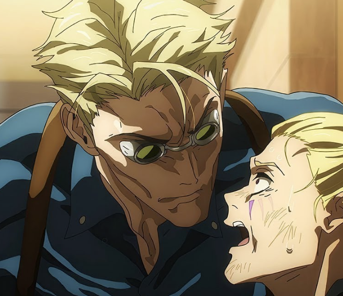

### 2/6/26 I'm Doing Music

Hey, I'm back. 

Let’s catch you all up, dearest readers. 

I don’t even know when my last blog post was. I’m just glad I remembered I have one lol.

Anyways, it’s been two years since I quit my corporate job to pursue my dreams or whatever. Or at least that’s the narrative I’ve told myself. I now know that no one ever “figures it out”. Thinking you got it all figured out is propaganda given that there’s an infinite list of unexpected things that can happen.
One must be present day to day and appreciate the little beauty in the little moments. Meet yourself where you are at. Stop limiting the current happiness you could be experiencing. 

What it is is a state of being where you feel alright with yourself. You fuck with yourself. You have self-love and self-respect. You don’t put anyone on a pedestal. You’re only comparing yourself to who you were yesterday. You honor those that honor you and let the rest fall away, even if it leaves you isolated at times. You listen to your mind and body and do whatever it takes to remain as calm and focused as possible in this messed up world. 
For example, I slept in until 2pm the other day because I knew my mind and body needed it and I didn’t feel bad about it. I used to beat myself over something like this. 
___

I was showing a friend my soundcloud yesterday and I looked and saw that one of my favorite songs I’ve ever made was released nearly 2 years ago. 

Two years ago! Holy fuck what the hell happened? I’ve released almost nothing official for myself since then and I still have barely logged more than 30 hours on Ableton. I’m still scared of the boring process of learning mixing. Or at least that’s the negative mindset I’m still trying to shake. Perfectionistic and lazy fuck I am <3. I feel scared. I feel like this means I’ve been procrastinating music for 2 years!? 

But that’s not true. There’s a little more than that. I play my guitars everyday. 

I keep beating myself up to this day saying, “Why can't I just pick one hobby?” But it’s actually not a “hobby”, it’s a foundational path and lifestyle I can’t decide on. Being an artist is a way to go about life, and it’s definitely my default setting I can’t change. It’d be all our default settings if we didn’t live in this fucked up society. What I’m talking about is a career lifepath. I’m talking about the way I overthink everything. My gift and my curse. 

I looked at the lifepath of an actor. This looks like being on sets, traveling to NYC a lot more and probably moving there, doing slates everyday, practicing monologues, listening to actors on podcasts, writing scripts, studying films…

It’s similar to a videographer/video editor. Another path I tried. Being that involves studying films as well, purchasing expensive equipment I’m scared to break, and staring at screens. It’s also sitting in front of a computer for hours everyday. 

My eyeballs have been throbbing. 

I looked at the life of a model. If you break into the industry it looks like travel, photoshoots, brand deals, and selling yourself as a product. It looks fun and a bit exhausting, but it’s also a risky gig economy where you may go months without work. 

I looked at the life of a freelance software developer. That looks like a lot of time on my computer as well. It’s the total optimization of my brain when I want to turn my thoughts off. This one is hard to have as a hobby. If you don’t stay consistent with working on projects and learning, the rust builds up fast. Being a software engineer demands your full attention. 

I finally decided that these are fun pursuits I will absolutely allocate time for to the best of my ability. But I will not do any of them if they get in the way of my pursuit of music. 

When I quit my corporate job, my goal was to do music AND try out some other things cause why not? And it’s funny because I did that, but in my search to try out other things I only ended up back where I started. I was open to getting into something more than music and I didn’t. It still remains on top. 

I also spent a lot of time rotting in my bed. Rotting in my head. Not a good time. 
Gotta stay busy in this life. Not in the “hustle culture grindset" way, but in the” know when you’re resting too much because otherwise you’ll slip into sloth and sulk for hours” kind of way. 

I’ve now made music my priority. If I mess up everything else, so be it. It only took me two years of hesitancy. I accept it. I accept the lifestyle. The grind of it. The time of isolation. The challenges. It’s the one above the rest. 
If I were to die young I’d be most regretful that I didn’t dump my soul into music. It’s music where my soul has the most to say. It’s there that it’s most expressive and separated from my human form. 

By God though did I need to recalibrate my approach to music. I got sucked up into the mindset and opinions of others. I needed to recalibrate myself as an artist and as a human as well. 

I’m done with pretentious musicians. I’m done with egotistical musicians. I’m done with artists and people who can’t acknowledge their privilege. I’m done with gatekeeping. I’m done with cliques. I’m done with the boxes I put music and myself into. 

Make whatever your heart feels, even if that's screaming while scraping your nails on a chalkboard then turning up the distortion. Combine EDM and Deftones. Randomly reverse half of those snare samples. 

I URGE YOU TO REMEMBER THAT THERE ARE NO RULES WITH YOUR ART. CREATE WHATEVER THE FUCK YOU WANT!!!

It’s for you. Make stuff that you like and interests you. Don’t get in your own way by assigning rules you must follow and boxes you must fit in for they are written by no one but yourself. 

At shows we're here to feel. To close our eyes and move around, and in between maybe have a beer and make a friend. Maybe you even show them your gas station vape that for some reason has a calculator built into it.

And look, back to what I was saying earlier, I know that over the past two years I played a ton of shows, rehearsed a lot, had mixing sessions with other artists, and [MADE AN ALBUM FOR GODSAKES](https://music.apple.com/us/artist/dimmer/1724865544), but this all felt like a warmup. 

Like now I know how all of it works. Now I have full control over my music and complete confidence in myself. 
I have taken a break from the Philly scene. I’ve kind of taken a break from music in general. 

After I ended Dimmer I really needed clarity. I did not feel free and myself musically speaking and in general. I needed to recalibrate. I needed to remember why I love music! How it makes me feel. How it takes my soul somewhere out of sight in a mere second. 

I know that I’ll get back to this place, but I’m sad at the moment that I lost so much touch with this.

I became what I always despised. Analyzing a song and studying it for its technicality instead of what it’s trying to say. 

Oh you really like the ghost notes that get played in the post-chorus after the key change? Yeah I liked the feel of that too. What I liked the most however was how it made me cry. 

The emotion of a song is the most important aspect to me. Not to say the little details aren’t, or that learning technical lingo isn’t helpful, but what’s the point of all that if you’re not trying to relate to your art on an emotional level? 

It’s like performing math that doesn’t even solve a problem. It’s the same as someone who’s extremely fit. It shows amazing discipline, but it gets boring to watch the same feats over and over again real quick. 

Music theory from a mathematical standpoint is beautiful to me. I love getting impressed from time to time by musicians who show off how well they know this, but I never got into music to listen to other musicians show off their technical ability. 

But if you're all about technicality with music or whatever it is, and that fulfills you, by all means go ahead. It’s just not my prerogative with music. 

If I could somehow make music without having to understand it I would (and no I’m not trying to say I support A.I.).
I’m sad that I got so far away from this fundamental approach but I’m getting it back. 

I became musically conscious in 6th grade thanks to Skrillex, Avicii, and Knife Party. 

I finally went out of my way to listen to more music outside of mainstream radio artists in 8th grade. It was Kid Cudi. To this day I think his album [*Passion, Pain, & Demon Slayin*](https://www.youtube.com/watch?v=fFWrk5tHnJc&list=PLq_dfk_3kL_qH9mChVvmWU9Ux2xdIbj-l) is slept on. 

Then I discovered Fantano and he opened up a whole world of music I never even knew existed. Listening to Xiu Xiu’s [*Girl With a Basket of Fruit*](https://www.youtube.com/watch?v=3zn5XDJVqEc&list=PLnMc0DcIgIXLxoIYsGJhjumbom5aWVR8Z) sent my mind into a vortex in high school. What the hell even is this? I knew I barely scratched the surface of what’s out there. 

Hip Hop and Rap felt like a totally different world I didn’t know existed. It got me hyped up, but it was only until I found Brockhampton that I understood the larger message music can have, and how deep it could impact me. Also how communal and expressive it can be. 

Then after my first house show in Philly I fell in love with the underground. 

Mike showed me [*Destiny XL*](https://www.youtube.com/watch?v=MACRUoTDnMs&list=PLna7IqdwfDkHws4MTYRJ1N0z_Dhq_-yKv) by Tagabow and it was over. My brain chemistry got changed. The underground sucked me in whether I wanted it to or not. This was different. I felt like this was where I'm supposed to be. 

Recently I’ve been reinvigorated by modern EDM, hyperpop, and dance type stuff. Frost Children’s [*SISTER*](https://www.youtube.com/watch?v=S02R8n8xFCI&list=OLAK5uy_kosPrBQ5pHQOsp26VBsDdhJwV8PRg0TAU) has shown me that... HOLY FUCK we can make shit like this from our bedrooms!? Ninajirochi, Glaive, 2hollis, bassvictim, Joontoon and artists like this have opened up a new chapter for me sonically. 

I have no idea what my music is going to sound like, but it’s going to be weird. I just hope none of the music I'm inevitably going to rip off it too blatant. 

I guess I’m going to be a rockstar. Not because it’s the most appealing thing I’ve ever imagined, but it looks to be the best when I compare it to all the other bullshit. 

I have the same mindset to music that Nanami has to being a Jujustu Sorcerer.

___
### 2/8/26 Epstein Files Delirium 

Regarding the Epstein Files… just wow I love being energy harvested. I love that I am given all this knowledge yet not given any power to do something about it :)

Actually not true btw. 

I’ve been having extreme anxiety, depression, and apathy over the release of the files and the fact that it is all over my algorithm isn’t helping. However what I’d like to say is that if you feel the same way I do when things like this happen you need to do your best to process your emotions. I'm not saying to not stay informed. This is world shattering stuff. This is the real world equivalent of finding out what’s in the basement at the end of season 3 of Attack on Titan. 

“But how do I ignore these horrible actions by these rich and powerful individuals when no one is holding them accountable!?”

Going crazy and being upset about this is normal actually. Realizing that people who torture, abuse, rape, and kill children have immense power over you and the lives of everyone you love should leave you more then a little flustered. This website is literally being hosted on Github which is owned by Microsoft which is owned by Bill Gates.

It’s good to be informed, but realize that they want you to feel paralyzed. They want you to stay in a state of inner turmoil so that you can be more easily managed and manipulated. Don’t let that happen, especially now. Go on walks, talk to a friend, eat your favorite ice cream, or whatever it is you need to do. Do these things as many times as you have to. 

Get away from the digital world and ask yourself, “What can I do in my sphere and my community to have effective positive change?” 

I know some things that I can do to help. One of them is pretty bold. I’m scared to do it although it’s nothing violent. 

Courage and bravery is not having no fear, it’s going through with whatever is scaring you despite the fear. 

One day it will end, so be present and happy day to day. You don’t get time back. 

I promise that you can run laps around these fucks. These manchildren can’t throw money at their problems forever. Soon they're going to have to face that they face the same fate as the cattle they control. 

*Think they control. 
