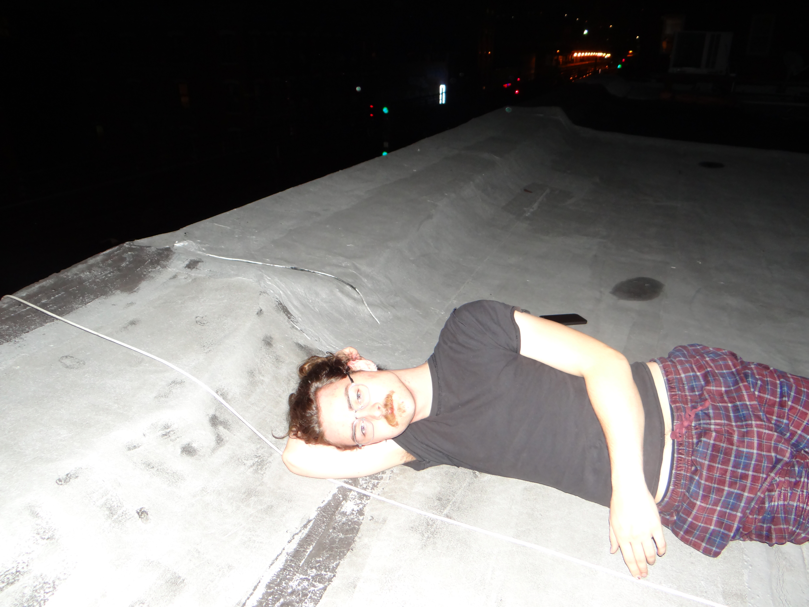

Interviewed on 7.8.25

<audio controls src="Jeb.m4a" style="width: 350px;"></audio>
___

 

[Jeb](https://www.instagram.com/worldofjeb/)... my happy friend, creator, artist, musician, cinephile, dancer, and professional funeral director. Owner of a uniquely creative and friendly soul, he has been out in the big city fulfilling sidequests and working on projects of the most extravegant, strange, and curious kind that we'll get into later. I had the pleasure of visiting and interviewing him in NYC while on his conquest to make the iconic [Jeb hats](https://ilovemucus.com/) a household item for every family. From the roof of his Brooklyn sublet, with the L train rumbling by within arms reach, I asked the most pointed questions I could think of to best dissect bro's inner world. 

This is the world of Jeb:

___

All right, Jeb. The first question is...
## Q1: What's your name and what's your background? 

My name is Jeb McCormick and my background... I don't know what my background is, but I do know I see a hand or a foot of some kind of person. 

**Oh...**

Are they naked? 

**I don't think we should be looking over there. Oh, it's just an elbow.**

No. I think there's like a... okay that's creepy. Um.. give me sec. 

___

## Q2: How did growing up in Honesdale, PA shape your creativity? 

Growing up in Honesdale made me understand a huge side of life that many people don't get to experience. So working on a farm. Working really weird jobs. Being alone... Being on a farm... Being surrounded by a lot of people I didn't really connect with, but I didn't know anything else. That is what gave me a lot of insight on the world and allows me to to think of and construct abstract ideas that are realistic in the world. 

___

## Q3: Content Creation, Film, & Music
**Yes. All right I got to up the energy. So, Jeb, I've categorized the things you do into three separate spheres, which I've told you about, and that's:**
 1. Content creation
 2.  Film 
 3. Music

**Could you talk about each one and how your artistic approach may be similar or different and how they overlap with each other?**

Yeah, let's wait for this train to go by. 

**Yeah, we shall.** 

So the place that each of the mediums overlap is probably "absurd ideas". I can't really figure it out. I know all my stuff is fitting in the same category, but there is something that all my stuff has in common that I can't pinpoint. I think it's really absurd abstract stuff being able to be comprehended in a cohesive narrative that makes sense in my own way. I think that's a unique thing. Yeah, so in all these mediums, there are definitely a lot of poetry and word play in visual format and verbatim lyrics. 

When it comes to differences, I think it's the workflow. 

So with music, I throw stuff at the wall and I can really work fast and I know I just have a good feeling for what I want out of a song. I don't really linger on it too much. 

With films... with actual narrative films... I take a long time developing and pinpointing ideas, writing down things, and connecting them so it could be a grande giant masterpiece spectacle, and something I'm really proud of. So films are my ultimate craft of culmination, which includes all the mediums. 

And then content creation usually are my spontaneous ideas. I've gotten more particular with them, but they're still really strange, really concise, quick ideas that I'm not going to turn into a film. But they could be a film. They're my experimentations that I care a lot about still. 



### Content Creation 

**Yeah. So let's start with the content creation stuff. So you've come a long way from the prank style stuff. How do you look back at that time?**

Dude. I look back at it as a part of what I had to do to get where I am now, and I still do constantly think about really fucked up pranks that I could do to people... but most of them now aren't. I think that was the most easily content creatible thing, so I was thinking about what could be the most viral back then. It was easy cherry picks to do those pranks.

But I guess my videos are still very similar to that energy, but wayyyy more mature. That's definitely the farthest thing from mature, but they've matured in their own way... And now I think of them more as pieces that I can, like, really experiment on. Like little films. 

___



## Q4: Speaking of that, are we getting more of your new social media project [15 Second Films?](https://www.instagram.com/reel/DLqFyP3xe6-/) 

Are we getting more of it? Oh, shoot. Well, that, of course, is 100%. No matter what, I think I'm gonna pursue that. It's a great idea. I love it and there's definitely going to be more episodes. I don't know at what rate, but... 

**Okay.**

___



## Q5: Where did the idea to have hats with your face on them come from?

I was... I think I tell people that I was thinking about what could be the most... I don't like the idea of merch, but I would always want to have something to sell. So I was like, "What could dub as something that... What was the most spectacle? What is the weirdest thing I could have that is the most visceral thing?" I was thinking about it, and faces are the most visceral thing humans can pick up. Like, you see faces in everything. I was thinking if I somehow managed to get this hat to look like an actual face, it would be so freaky. It's like a leech on someone's head. And to have your own face on there, it's like, this is so bizarre. And it's very, like, doable, reproducible, and let's wait for the train to go by...

It's the product that is the most easily producible that represents a physical product of like what I want my "brand" to be overall with [mucus](https://ilovemucus.com/). That company. It's not really a company, but just project: *Mucus*, which is like physical products from my stuff. Which I think I might turn into kind of like... with my music too, maybe eventually records could be on there. 

**Okay, then switching over to music, you have uh...**

I like how organized this is. 

___

## Q6: Do you have any inspirations when you perform? Is there anyone you want to perform like? 

My inspirations for performance? Ah. I like [Ian Curtis](https://en.wikipedia.org/wiki/Ian_Curtis) a lot. I like the guy from... [Yahweh Nailgun](https://www.instagram.com/yhwhnailgun/). That guy's cool. Uh... Yeah, I'm thinking of physical performances... Yeah, those two are sick. Ween and obviously, Modest Mouse. Those are more musical inspirations. 

**Yeah, I know you're a big Modest Mouse fan.**

___

## Q7: What other bands are you a fan of, and what Philly bands are you also inspired by?

Oh, so, I mean, off the bat, Philly bands and bands have to go to [Alex G](https://www.instagram.com/sandyalexg/). He's the G.O.A.T., Philly, man. So, definitely him. [AlltheFlowers](https://www.instagram.com/alltheflowersband/) are some really good friends of mine who helped me out with music and inspiring music. They have a great feel. [Cold Court](https://www.instagram.com/coldcourtband/) is really good. They're good to play with. [Jim E. Brown](https://www.instagram.com/jimebrown666/) is really hilarious and a freaking great performer. That's another guy I try to figure out how he does it so well with performance and engagement. And umm... I'm being stupid why am I blanking so hard?

**Aphex Twin?** 

Oh, well, dude duh. I'm thinking. Yeah, Aphex Twin. Frank Zappa I love. I like Ween a lot. I like Cameron Winter. [His new album](https://cameronwinter.bandcamp.com/album/heavy-metal)'s great. I like [Animal Collective](https://www.instagram.com/anmlcollective/), been listening to a lot of them. They have some sicko stuff on there. [Feeble Little Horse](https://www.instagram.com/feeblelittlehorse/) is really cool, and Hole. I like Hole a lot. 

**Yeah, Hole's great.**

Yeah, they have some really good stuff. I'm trying to think. I don't listen that much anymore, but that's one of my first inspirations. 

***I'mmm Misssss worrrrld...*** 

Wait let me think of one more... Oh, and fucking Elliot Smith, of course. 

**That that was it, that was the one.**

___

## Q8: What is the music scene like in New York City and how do you think it compares to Philly? 

**I know you haven't been here that long...**

The music scene is more.. legit. Not legit. I wouldn't say legit in a good way. I think legit in, like... people are playing. 

Okay, so most, I think 90% of the shows I've ever seen here are in a legit venue that's run by like.. I don't know. It feels very, like, proper. There was one show I went to that was on the roof that was really cool that reminded me of a lot of Philadelphia. 

So I prefer Philly for all shows any time. There's more people you feel like you can talk talk to. There's less pretending to be cool. There's more raw, real music that people are just doing it to do it and they love it. They're putting together shows in so many freaking basements and weird spots and like forcing it to happen because that's what you can do. And a lot of people don't have money for, like, venues like they do here. 

___

## Q9: How do you feel about New York City overall? Who are you here with? 

I love it here too much. I'm here with my friend [Phoenix](https://www.instagram.com/blissofphoenix/), my friend [River](https://www.instagram.com/flockofswan/), and my friend [Becca](https://www.instagram.com/becca.ford/). My new friend Becca, who took took the chance to live with us randomly hehe. We're subletting it from her friends. But she took the chance to move in with these strange men, and it turned out we're all really best, great friends. We do a lot together, and we're very very comfortable around each other. We really tell each other a lot and help each other. 

**I'll say.** 

Yeah, we're all in the same page. It's the most positive living environment you could imagine. It's really weird. I'm scared to leave it. I've met so many people here and been so inspired by creative people, and there's constantly stuff happening. It feels like it should stop and die down, but it's just constantly going. It's a little bit of a dream world, but somehow I'm not sick of it, so...

**Hell yeah Jeb. Before I jump to my last questions, I'll ask you some on film since that was the other sphere. So...**

___ 
## Q10: I know that you're David Lynch fan. He's your favorite director, right? What's your favorite film of his and why? 

Yeah, David Lynch. I would say.. Well, okay, David Lynch might not be my favorite. I think he's tied because [Ari Aster](https://en.wikipedia.org/wiki/Ari_Aster) might be my favorite. 

But my favorite Lynch film? I think.. Oh, it's a short film called [*The Grandma*](https://vimeo.com/1065140150). 

**Grandma.** 

I think that one might be my favorite. Yeah. I mean, I like his huger stuff. The atmospheres are amazing. [Moholland Drive](https://www.youtube.com/watch?v=7KgH9n1c4mM) really sticks with me atmospherically. It's not the most narratively, like, engaging thing, but it's just something that sits with you. That's what David Lynch is. Just like feeling shit. That's what really sticks with me about him. There's not many people... That's why a lot of people don't like him, think it's pretentious, but it's really genius stuff. 

He has a film called [*Rabbits*](https://www.youtube.com/watch?v=drjQfQtv2BQ). It was really freaky sick creepy. But Twin Peaks, that's just so good. It's like, again, it's weird, you can't follow it super well sometimes, but the atmosphere... there's no other show that's more rewatchable. There's no more lovable characters than there are in Twin Peaks. There's so many motifs in there that you just love, and there's something strange. You can't get enough of it.

___

## Q11: Are you excited for everyone to see *Exuvia*? Could you tell us more about it? 



Yeah, *Exuvia*. It's funny cause I'm trying to think about how *Exuvia* would be if I didn't do social media because I had this weird dilemma. Especially actually right now in the world. 

There was a weird dilemma where no one really knows... like I have postponed releasing this on YouTube, because I have only ever known YouTube, for me, to post YouTube videos in lesser effort. I took a year on this project. Ten times longer than anything else I've ever done. And... I have not put it out yet because it's so personal, and I think it's really great. 

**I loved it.**

Yeah, dude, thank you, man. I appreciate it. I don't know. So I'm putting it through festivals, I guess. I'm seeing who accepts it by the end of August, and then from there, I'm going to release it on YouTube, because there's no point in leaving it and not letting people see it. And one of my friends, Chris, I was talking to at the [Tribecca Film Festival](https://www.tribecafilm.com/)...

... *train rumbles by* ...

My friend Chris, who I met at this film festival made this great feature film. It was an eye opener because I loved it so much, and it's Tribecca, and it's like one of the biggest in the world. He's like, 27. I talked to him organically and he didn't know I did social media. And he told me, after we talked about social media, he was like, "Dude, I would kill for an audience like this. Like, you have the upper hand. This is more valuable than Tribecca at the end of the day, like, eyes are what matters." I was like, "Holy crap, he's right." But I already submitted to these festivals. I'll see if I can get it up. So it should be out in October, but I don't know what to do, because I think... It's not "too good" for YouTube or anything like that, but it's definitely not anything I've ever done before, so it's kind of in purgatory about where I should put it. 

So I think it will be out in August no matter what. I mean like fall. 

**Cool.**

Which means it'll be... that's a year and a half since we started production, it's kind of weird.

**That's how long these things take?**

Some strange guy over there... (*Referring to person in window across the way.*)

___

## Q12: What else could we expect to see before the end of this year? 

An EP, a music video, another film called *Our Plumber*. *Exuvia*. A ton of social media content. A development of the *Mucus* brand. And the production or pre-production of one more film, of another film that is probably going to be called *The Botanist*. That would be the next film to do. 

But yeah, I actually have a film called *Our Plumber* that's kind of an experiment, but it's really cool. That's going to be something that gets out quick. It's pretty disgusting and gnarly, so I don't know if it'll be good for YouTube, but...

Also, I don't even know what's going to be till the year ends. I do know a few things are certain. A few shows in person. And a big show at [Philamoca](https://www.instagram.com/philamoca/). 

**Yeah are you able to share any details of that yet?**

I don't. All the bands on the bill have really strange names besides [Ashton Freeman](https://www.instagram.com/souperfruit/). But Ashton is the child of one of the Weens, and I can't remember who. I'm blanking. 

**Is their last name "Ween"?**

No, Freeman. I think. I'm excited. They seemed really nice talking on Instagram. 

**Word. This is my last question Jeb...** 

___

## Q13: What advice do you have for other artists and creatives out there? 

I think uh, this sounds cliché, I think but:

> 'really, really, really, truly, like, just be be yourself with it.' 

Be yourself and don't have any holdbacks or regrets. You can definitely have regrets, but certainly go for it. Do all you can. Like, I just planned to move to New York, I moved to New York. I made a film, I forced myself to make a film. I didn't force, I loved it, but it's really hard. That's the one thing. It's just so hard. And there's so much love into it, and it's like, you don't see the fruits of your labors for a while. So that roots out anyone who's not doing it for the love of it. 

Most successful people who are long term successful creative people will always be true artists, because that's the only way it works. Some people get really big and then fade out because it's some fluke. But true artists will always be artists, no matter what, and it's not even about success stuff... but the success really does come! 

For example, moving to New York, I've met so many more people, new people, and had so many opportunities just by being myself. I've seen so many new paths. But oh! Most important thing is going to new locations and trying new things. Meeting new people. That's certainly it. But don't get too excited about new opportunities and pickings. 

If you told myself one year ago what I was doing that what I have done in this previous year, I would shit my pants, actually. Probably. Actually looking back on it, I cannot believe it. What has happened in a year with the stuff so. 

**That's so awesome.**

Even though actually, I had a lot of like... 

For example, something I would be sad about is I didn't grow on social media as much as I did in one year. But, actually, I did. Because for some reason, there's way more! I have way better quality stuff. People respect it more and I love it more. 

That was a long answer. 

**Good answer.**



___

## Bonus Q: Any homies you wanna shout out Jeb? 

Gary Snipes. I don't know where he is but he's helped me out through so many things and I love him. 

There's Phoenix, River, and Becca. The people I'm living with here have helped me through so much. They certainly have been through a lot of things and are all extremely creative and talented in their own ways. There is no doubt. 

There's so many people I could freaking say this about, but freaking [Kellen](https://www.instagram.com/kellenzecch/). [Brady](https://www.instagram.com/bradyonbusiness/). Dude, there's so many people. If I start listing more I'll get guilty. But those are the people that come to mind. [Alex Eichenlaub](https://www.instagram.com/gator.hook/)! Hehe. So all those people I love, and I love everyone that I didn't list too.

___

**P.S. Special thanks again to Jeb, Phoenix, River, and Becca for letting me crash this summer. <3**

If you liked this interview and you want to see more you can always help by buying me a [sexy ko-fi](https://ko-fi.com/gsnipe) ;)