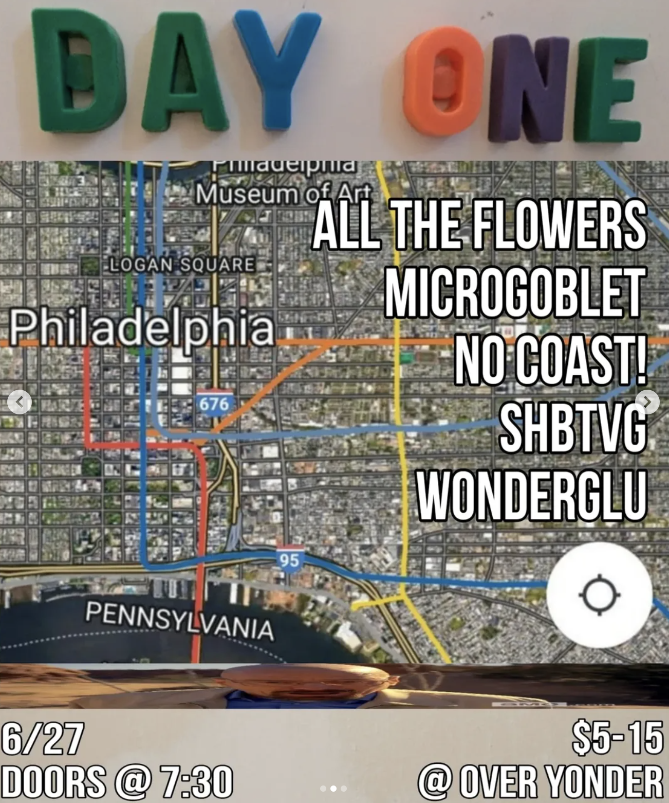
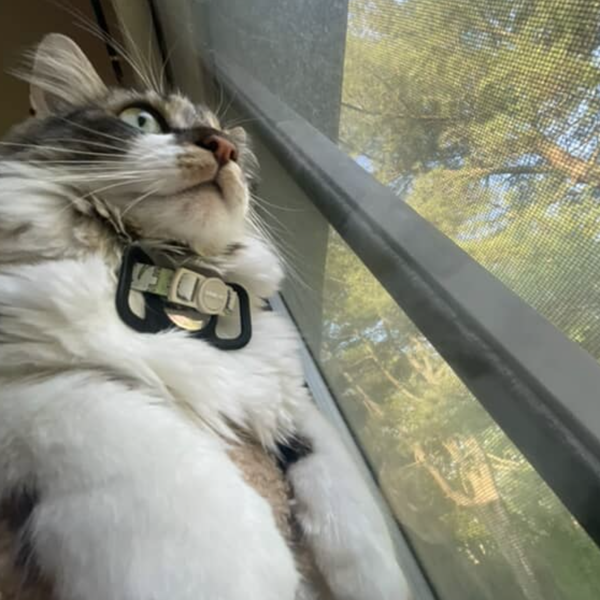
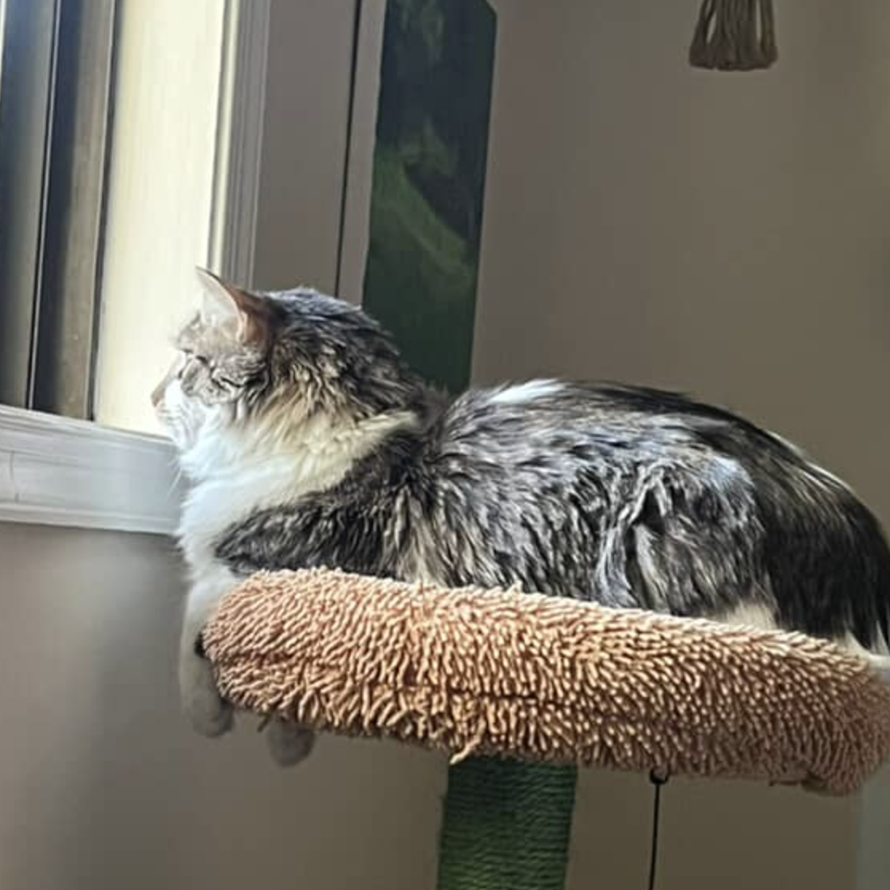

<audio controls src="atf.m4a" style="width: 350px;"></audio>

___

They've been playing the Philly diy circuit for quite a while now. You should know them by now, but if you don't that's okay because I decided to catch up with them after [Over Yonder](https://www.instagram.com/overyonder.phl/)'s penultimate house show. I'm talking of course about the Philly indie sing-along ensemble [AlltheFlowers](https://www.instagram.com/alltheflowersband/)! AlltheFlowers from left to right is comprised of Esther Joy Landis on violin, Ryan David Hankins on guitar, Riley Hall on vocals and guitar, and Patrick Joseph Sinisgalli on drums. Although its safe to say that Riley is the lead vocalist, ATF makes sure everyone's vocal chops are put on display in their music as well as their live performances.

Also later on there is a special guest appearance and question for Over Yonder's sound tech [Ariel](https://www.instagram.com/shower_wrench/)!

____

Bill from the night: 

____

**Ryan:** On tour I think I ate 20 Chicken McNuggets the first night, and farted the entire apartment out... It was bad. But you know what? It's why I love these people, because they put up with my farts. Do they smell? 

**Patrick:** Uh yeah, sometimes. It depends on what you got cooking. 

**Riley:** Guys, why is the first minute of this interview about Ryan's fucking McNugget farts? 

**No, please go on.**

**All:** *Haha!*

**Patrick:** This is good backstory. 

**Ryan:** Do tell.

**Patrick:** Yeah no it was crazy. It was 20 McNuggets in 20 minutes. It was a nugget a minute. 

**Ryan:** I think I got it in under 20 minutes.

**Patrick:** It was about like 18...

**Riley:** Maybe 12.

**Patrick:** And two packets of ranch. Impressive. 

**Riley:** And then we just heard *"loud squeek-like noise"*. Ryan impression: *What!? I ate 20 McNuggets!?*

**Ryan:** I felt awful. 

**Esther:** Yeah you weren't stoked about it. 

**Riley:** I ate a bite of my burger, and it tasted a little rubbery. And I was like yeah...

**Patrick:** "Awful" with a sparkle in the eye.  

**Wait, what was that noise you made supposed to be?**

**Riley:** Ryan's fart, on the porch. 

**Oh, really?**

**Riley:** Yeah lol. 

**Esther:** Yeah that wasn't clear *haha!*

**I thought you were trying to do the McDonald's like [*du-du du*](https://www.youtube.com/watch?v=yyOHQ3h_Vh0).**

**Riley:** No, that was a squeak. 

**Ryan:** Oh, I know you're talking about. Dude when Alex plays bass with us he plays that on the bass.

**Dude, Jeff (my bandmate) does that every time we practice.**

**Riley is trying to imitate the Mcdonald's beeps.*

**Ryan:** Like we'll end Girard and Alex will play that on the bass all the time. So funny.

____

## Q1: How are you guys feeling? 

**Riley:** Good. That was a fun show. 

**Patrick:** Pretty good. Umm I was anxious all night but I feel great now. 

**Esther:** Good. 

### How'd you feel this show went? 

**Riley:** Great!

**Patrick:** Good! Yeah. I think we played well. 

**Esther:** Really good. 

**Riley:** I forgot like three words but I just backed up and Patrick got it so...

**Patrick:** First time. 

**Riley:** I know! Usually if I stop singing, Patrick stops singing, but he kept going and knew the words.

**Ryan:** Yeah. Also, like, Over Yonder has a really good sound system in the basement.

**Esther:** Yeah.

**Riley:** Yeah, it was awesome. 

**Ryan:** Obviously, we don't really care about, like... it doesn't matter for our sound, but it's really nice to play in a basement where you can hear eachother and it helps with the energy too. It's like we can get quiet and then we can get loud again.

**Riley:** Oh for sure. 

**Esther:** We can actually, like, work off each other.

**Ryan:** Yeah. 

**Patrick:** This whole interview is just going to be us talking about how great Over Yonder was. 

**Esther:** Yeah. 

**Riley & Esther:** *Hahaha.*

**That's fine. Do you guys feel like there's a bittersweet energy in the air tonight?**

**Riley:** Yeeeahh. I almost shed a tear.

**Patrick:** Yes I'm gonna miss it. This has become the hallmark of an era for us. 

**Esther:** Yeah. 

**Patrick:** We played here so many times. They put us on so many cool bills. 

**Riley:** We were in college when we were playing here, like we all lived walking distance, in different directions when we started playing here.

**Patrick:** We had like home bases in every direction. Now coming here... most of us have graduated lol.

**All:** *Haha.*

___

## Q2: Did you guys all go to Temple? 

**Ryan:** Yes. We all went to Temple... Patrick, Riley, and I grew up together. We met Esther, at Temple.

**Riley:** Our parents all live in the same like, 400 feet? 

**Ryan:** Yeah. 

**Patrick:** Yeah. I grew up around the corner from Ryan. I met Ryan when I was like four. 

**Riley:** I grew up around the corner from him. So it's like.. 

**Patrick:** I hope we're not cutting off some of your later questions *hahaha!*

**No, the first, the first question I think I'm gonna ask everyone I interview is...**

___

## Q3: What's your names? What do you play, and what's your musical background? 

**Patrick:** Are you asking that right now? 

**Yes.**

**Ryan:** I'm Ryan. I play guitar, and I grew up on Skrillex.

**All:** *Hahahaha!*

**Esther:** Okay...

**Patrick:** I guess you kind of did. You were a producer for a while. You made dubstep music. 

**Ryan:** Yeah, I DJ'd here with [Merr](https://www.instagram.com/alien___body/) who used to live it at Over Yonder.

**Patrick:** Did you have a DJ name when you were a kid?

**Ryan:** No, I did not but I wish I did. 

**Patrick:** Bummer dude, you should've. Anyways I'm Patrick Sinisgalli, I play drums and do a little hooting and hollering. Umm... Oh, what's my musical background? I was in a band with Ryan when I was like 12, and then I did School of Rock. 

**Ryan:** We were called Power Chord.

**Patrick:** We were called Power Chord, and it was way better than this. 

**Ryan:** And we do used to cover Holiday by Green Day. 

**Patrick:** Oh, yeah. 

**Ryan:** And American Idiot. 

**Patrick:** We wrote one song and it was 10 minutes. That was our whole set. 

**Really!?**

**Patrick:** Yeah *haha!*

**Ryan:** Yeah just covered Green Day songs. And then we did...

**Patrick:** We played two Green Day songs and then our one 10 minutes song. We played one 10 minute song about dancing under the Hollywood sign. 

**You guys really do, like [Swans](https://en.wikipedia.org/wiki/To_Be_Kind). (Referring to Ryan's *Filth* t-shirt.)**

**All:** *Hehehe.*

**Ryan:** Yeah...

**Riley:** All right Esther. 

**Esther:** I'm Esther. I play violin. Annnnd I grew up playing violin. In like fourth grade at my school district, you could learn an instrument and take lessons there. So I grew up in the school orchestra, so I did that 4th through 12th grade, and that's how I learned violin. But then also outside of school my family is very musical, so we would do, like, little family band moments. 

**Patrick:** Dude I love the family band photos. 

**Riley:** There's a really big roach that almost walked on my foot.

**Oh there it is!**

**Riley:** Yeah sorry. 

**Esther:** *Hehe* and so I think I got a lot better at like, the more individual playing and improvising part of playing an instrument by doing the family band stuff. But I got pretty good at all of the skills through the school orchestra. 

**Patrick:** I never asked you how you started on violin. 

**Esther:** Mr. Shawbock. Shout out Rob. Robert Shawbock.

**Patrick:** Shoutout Bobby, put one up for Bobby. 

**Ryan:** Big ups.

**Esther:** Yeah. Moving on?

**Patrick:** (Too Riley) Did you just *"erm"* me? 

**Riley:** No I was *erming* the cockroach.

**Are you scared?** 

**Riley:** I mean, I don't want it on me. I'm just keeping an eye. I'm Riley. My musical background...
I've played keyboard since I was a really little kid, but I'm kind of self taught in the music world. I'm sure that's frustrating for you guys sometimes *hehe*, but..

**Patrick:** No you're a natural talent.

**Riley:** I did do plays and stuff like singing wise, so I've been singing for a while, and then I picked up guitar in high school and had a little solo band for a little bit. That was kind of garbage. And thennnn...

**Ryan:** That sounds cool, could have a Soundcloud. 

**Riley:** *Hahaha.*

**What was it called?**

**Riley:** Riles. Like, "R", "I", "L", "E", "S". Anyway, don't listen to that stuff. 

**Ryan:** Put it up on Soundcloud!

**Riley:** The mixing is horrible and I recorded it on my Apple earbuds! And then yeah, and now I'm here.

**Patrick:** I like that. 

___

## Q4: What's the origin of this band? Has this always been the name? 

**Riley:** Soooo Patrick's gonna tell you lies. 

**Patrick:** Oh okay.

**Riley:** I'm gonna hit you with the with the straight facts. 

**Patrick:** Oh, alright.

**Riley:** We were going for a walk with his dogs in the neighborhood. We've been dating for almost five years now,
and we were like, "What if we made music together, because we're both musicians?" And we were like, "Yeah, that could be cool." While we walked more we were like, "Well, if we became a band, what would our band name be?" And we were looking at his mother's beautiful garden, and I suggested AlltheFlowers!

**Patrick:** Sure.

**Riley:** And Patrick loved it. But now Patrick, like did so much that he thinks that he came up with it.

**Patrick:** Through all the lies and slander... 

**Riley:** It's not!

**Patrick:** The truth will be revealed. One day we'll pull it up on video...

**Riley:** Pull up the tapes lol.

**Patrick:** That I named the band.

**Riley:** You didn't.

**Patrick:** But Riley was trying to have a comeback of her famed RILES career. Trying to have a comeback of her career, and I was gonna play bass in her comeback band, even though I have no idea how to play bass.

**Riley:** You figured it out. 

**Patrick:** I was figuring it out. And then we went to go cover [Sober](https://mumblr.bandcamp.com/track/sober) by [Mumblr](https://www.instagram.com/yomumblr/).
<iframe style="border-radius:12px" src="https://open.spotify.com/embed/track/3qirUTCEp2iJiMrTNhqD6Z?utm_source=generator" width="100%" height="352" frameBorder="0" allowfullscreen="" allow="autoplay; clipboard-write; encrypted-media; fullscreen; picture-in-picture" loading="lazy"></iframe>

**Patrick:** Shoutout Mumblr. Then we were like, let's just copy this band.

**All:**  *Laughing.*

**Patrick:** We were like, let's write music. It's not gonna sound anything like what either one of us had done before. So new band. And then God reached his finger down and touched my brain: <u>AlltheFlowers</u>

**Riley:** *Hahahah.*

**Patrick:** In my mother's beautiful garden. Why you bullying me?

**Riley:** I came up with the name okay...

**Patrick:** Whatever. But yeah, that's pretty much how it went. And then we went on like trips, and it was just for funsies. We were recording in like random Airbnbs. And then a friend of ours was like, "Hey, come play this Temple live thing." We were like, "We don't have a band?" So we formed a band to play it. And then we're like alright we got a band which is how Ryan came in. All right, we got a band. What do we do now? We were like, "All right, we'll play shows, I guess." 

**Ryan:** Damn. 

___

## Q5: So what's up with the current lineup? 

**Patrick:** Oh, we're mixing and bobbing in bassists right now. Everybody's going through some big life changes. Esther is currently living in New York for the summer. 

**Esther:** Yup.

**Patrick:** So you know things are kind of a little bit more fluid as life is getting more or less... what's up guys!? 

*We all say goodbye and thank some leaving show goers.*

___

## Q6: Esther how's New York? 

**Esther:** It's big! It's fun, but, like, there's so many people there compared to Philly. I drove from New York to Philly today and I got to Philly and I was like, where's the people? Where are they?! I thought this is like a city!? What is happening? But it's good. I'm working for the Parks Department there. Yeah, it's great.

**Word. I heard some of the new stuff tonight, right?**

**Esther:** Mm-hmm.

**And it was really good. I'm really excited.**

**Riley:** Oh cool thanks!

___

## Q7: What could fans expect for your new releases?

**Ryan:** We're trying to make it sound as live as possible. That's one of the things we've been talking about as a band is trying to make everything sound like we do on stage. So a lot of the earlier stuff is very Riley and Pat DIY kind of stuff... which is really cool, and we're still trying to capture that sound, but it's also like we're kind of evolving as a live band. 

**Riley:** Yeah.

**Ryan:** It's one of those things where, like, I feel like people come to our shows and they love it, but... maybe people aren't  listening online as much? I don't know, not that that matters but...

**Esther:** I do feel like the recorded songs have a different vibe. 

**Riley:** Yeah they read different.

**Ryan:** It's still really cool. 

**Patrick:** We will write songs in a bubble and play them together, maybe twice, and then record it, and then we'll play them live and we'll be like, "Oh, this part sucks." And then we change the song completely. 

**Riley:** Even though it's already out...

**Patrick:** Even though it's already out, and we have a very bad habit of that. So this time, we're gonna play all the songs at a couple of shows, and then we're getting in the studio. 

**Riley:** We're actually getting it professionally recorded this time.

**Patrick:** We normally do it ourselves, but this time going to [Head Room](https://www.instagram.com/headroomphiladelphia/), recording with them. Very, very excited. We got five songs.

**Patrick:** They're a little different. 

**Patrick:** They're a little bit more dancey. We have two classic dramatic songs, and then...

**Riley:** The two you heard.

**Patrick:** Yes, and then a little bit more dancing, a little bit more upbeat songs, yeah.

**Ryan:** I think we love the vibe of people in the basement, like screaming. Our whole vibe is a band has been like everyone trying to sing the vocals.

**Riley:** Yeah.

**Ryan:** And I think we want to translate that.

**Patrick:** Can't go wrong with gang vocals.

**Riley:** No. Not at all.

**Ryan:** Which is fun, I don't know. 

**Riley:** It makes it fun. 

**Ryan:** Or even, like, we grew up playing soccer and going to soccer matches. It's fun when you hear like, everyone's singing the song and that kind of vibe is very important to us. 

**Riley:** No, I love it. I love when I hear all you guys screaming into the microphones, and it's like, I don't
know... *hehehe.*

**Ryan:** Yeah, it's like, even if we're not totally on pitch, it's just like, fun. It's cool. And we try to find moments where we match up pitch wise, but it's just fun to sing loud things. I think it's really important. Lyrics are so important to music. It's like, the most important thing.

**Riley:** I agree.

___

## Q8: How do you guys conjure your music and write lyrics? 

**Riley:** When we started for no reason, me and Patrick were like, "full album in three weeks!" Nobody knew us. We never played a gig. There's no reason we had to make an ENTIRE album in a month.

**Esther:** *Giggles.* 

**Riley:** And I was in art school, so I come home at like, 10pm and he's sitting in the room with the computer open, and he's like, "Are you ready?" I'm like, "No! I've been in the studio for 15 hours!" He's like, "But it's due at the end of the month." And I'm like, "Shit..."

**Patrick:** For no reason. 

**Ryan:** Yeah absolutely. 

**Patrick:** We both very strict about this deadline for absolutely no reason. 

**Riley:** I know...

**Patrick:** We went over the deadline and we were heartbroken.

**Riley:** *Burst of laughter.** 

**Patrick:** But I look back at that time very fondly. It was such a stupid thing for no reason, and the album... sucks.

**All:** *Hahahaha!*

**Ryan:** No that's not true!

**Riley:** It's not great.

**Patrick:** But there's some rough songs in there that if we just sat on for like, a little bit longer, they would have been better.

**Ryan:** No, but sitting on things can be kind of hard too right? 

**Patrick & **Riley:**** Yeah. 

**Ryan:** You don't want to sit on things for too long.

**Patrick:** Overthinking is the death of creativity. But these days, Riley writes a guitar part. We sit down. She'll have like, two different kind of vibes going, and I'll be like, "Okay, this one sounds like a chorus to me. This one sounds like a verse." And then we'll start building forms together, and randomly, one of us will be like, "Oh, we should do this here. You should do that there!" And then once that's done, we'll get a melody for it, we'll get some lyrics. We'll get the rest of the band and in on it. Riley and I kind of lay the groundwork, and we ask everybody to...

**Ryan:** Absolutely.

**Riley:** Very different from when we started.

**Patrick:** ...to make it sound good after we fuck it up. 

**Riley:** We started, like, trying to write two completely different genres, because we listened to very different music. 

**Ryan:** It's a lot of Patrick and Riley writing riffs together, and then kind of taking it to Esther and I, and we're like fleshing out songs further.

**Esther:** Mm-hmm.

**Ryan:** Versus before hand we were kind of like Patrick and Riley putting a song together. Let's record it. Let's get in the studio. Now it's more of like a community effort.

**Esther:** Yeah.

**Patrick:** Lovingly.

**Ryan:** To take our time with things a little more, but not in, like, a weird way where it's like, "Oh my God we gotta never release this thing." It's like let's take it to the band. Let's play a few times. 

**Patrick:** Yeah yeah yeah yeah. 

**Riley:** No, because it definitely evolves from when we write it to when we play it a couple times. You know?

**Ryan:** Totally. 

**Riley:** When we started, we wrote very different because we had completely different genres of music. So it was really both of us just arguing about which way the song was going, because he wanted it one way. I wanted it the other way, until one of us was just like, "All right!" So before it used to be Patrick had an idea for a song, wrote a song, I'd come up with the rest, and then I would have an idea for a song, and they were their own separate entities. And now we have learned how to write together.

**Patrick:** Kind of.

**Riley:** It's gotten a lot better. 

**Patrick:** It's got a lot better. 

**Esther:** *Chuckles.*

**Patrick:** It's hard to write songs with people. Sometimes you're very passionate about a singular idea. I'm talking about people in general.

**Patrick:** You're very passionate about a singular thing. And you'll pick, like, the smallest things while you're writing. You'll be like, "I really like this lyric." and the other person be like, "This is dog shit." And you're like, "My whole career as an artist... you've trampled over it."

**Riley:** Shambles!

**Patrick:** Yeah. 

**Riley:** I know we were like Esther come write! And then we just argued the whole time.

**Esther:** *Hehehe.*

**Patrick:** That's how it is.  

**Riley:** (Referring to Esther) You're like, "No it was good!" We're like, "Hold on!" Anyway...

**Patrick:** We love each other. It's okay.
 
**Riley:** What's said in the studio stays in the studio...

*Ariel appears.* 

**Riley:** Heyyyyy.

**Patrick:** Welcome to the interview! 

**What's up Ariel?** 

**Ryan:** What do you think about AlltheFlowers? 

**Patrick:** Ariel, genius of the hour. 

**Ariel:** Ask me a question!

___

## Question for Ariel: Are you sad about Over Yonder ending?

**Ariel:** I am sad. It's been such a incredibly meaningful, like creative project to have worked on for the past three years, and I put so much stock into it, both like as, you know, parts of my own identity as something that I consider a part of myself, but also just literally, like man hours. Labor. You know none of those moving blankets or the shelving unit or the drum kit or the various pieces of equipment, or the million feet of cable routing that you can't see, were there and we moved in. It, it took so so soooo much work, and it was all so completely worth it, and I would do it all again. It feels sad, of course. I don't know I'd call it more bittersweet. It's not like I'm going to cease to be involved in live music. I'm going to continue being involved in live music, but not as Over Yonder anymore. 

**Riley:** It's the end of an era.

**Yonder's Over.**

**Ariel:** Yeah, no. Literally. 

**Ryan:** We found yonder?

**Riley:** How I heard.

**Ariel:** Yeah, we yeah, we found it. 

**Riley:** It was cool to see how it evolved over time.

**Ariel:** I know right?

**Riley:** Like because we were saying we all started playing here, when we all lived in different spots all around here. So we'd all meet here and walk here. And now we've all graduated and have different jobs and we're still coming back here, and the place has just evolved over time. Remember when we came we were like, "You have wedges!?"

**Ariel:** Yeah I do right? Yeah. 

**Ryan:** It was killing it. 

**Riley:** We're like, "This is crazy!"

**Patrick:** Spoiled here. 

**Ryan:** Absolutely.

**Riley:** I know. 

**Ariel:** Oh yeah right?

**Ryan:** Remember the one day Merr and I DJ'ed here?

**Ariel:** I do remember that. Which one was that? Was that the umm...?

**Ryan:** It might have been the [Rowtone](https://www.instagram.com/rowtonephl/) after party or something? 

**Ariel:** That!

**Ryan:** And then there was another time before that I don't remember...

**Ariel:** It was like the OY Met Gala.

**Ryan & **Riley:**** Yes!

**Patrick:** Oh I loved that! 

**Ryan:** Oh we played?

**Riley:** Yeah we did.

**Patrick:** I was wearing a kilt. 

**Riley:** We got a sick ass photo right here. 

**Patrick:** I was gonna wear it tonight.

**Ariel:** Oh I wasn't at that one. 

**Riley:** Whyyy? :(

**Ariel:** I was at [Sweet Pill](https://www.instagram.com/sweetpilll/) Union Transfer.

**Riley:** Ohhhhh.

**Ryan:** Oh nice. 

**Esther:** Mm-hmm. 

**Patrick:** Worth it. 

**Ariel:** Like yeahhh, sure but like I don't know. 

**Riley:** Valid. 

**Ariel:** I feel like reflecting on it on that night, I was like, "I could have just seen AlltheFlowers."

**Patrick:** Seen us enough man, seen us enough. 

**Ariel takes down the Over Yonder sign.*

**Riley:** Noooo.

**Patrick:** Damn dude.

**Riley:** You had to do that? I'm about to cry bro. 

**Patrick:** Live in action. 

**You're gonna put back it out tomorrow?** 

**Ariel:** Well, yeah.

**Esther:** *Chuckles.*

___

## Q9: How is Creature?

**Esther:** *Haha!*

**Riley:** Oh my God! He's great.

**Patrick:** Creature is doing good. Creature is putting on weight. He was unhealthy for a while. 

**Riley:** He's almost 10 pounds!

**Patrick:** Being a street cat he had a lot of problems.

**Riley:** Being a suburban street cat bro. His diet is crazy. 

**Patrick:** Yeah, he's doing good. Lots of pets, lots of biting my hands. He needs his nail clips.

**Riley:** Going on hikes, enjoying the weather, chasing birds, killing flies. The usual. 

**Patrick:** Yeah I accidentally started a bird war in the apartment. 

**Riley:** Oh my God, its so bad. 

**Patrick:** I have a crow call. We have this tree in our backyard. It was full of songbirds.

**Riley:** Not anymore. Not anymore...

**Patrick:** And there was a house, like a couple of houses down. They had a bunch of crows in this tree. I started crow calling out my window, and it started summoning crows, so they start fighting. 

**Riley:** They started smashing into the windows. 

**Patrick:** Yeah, and I think that they realized that I was the cause of it, because the birds have been attacking the
house.

**Ha!**

**Patrick:** The birds keep slamming into our bedroom window! 

**Riley:** They keep running into the windows right where Creature's cat tree is like, level. So then Creature gets all flat and starts wiggling his butt, like he's about to do something and these birds are like: *Ding! ding! ding!*

**Patrick:** I fucked up.

**Riley:** I'm like, "What is going on?" And then we just hear *"squawk squawk!"*

**Esther:** *Laughing hysterically.*

**Patrick:** Yeah, I called the crows. I started a bird war. Now they're ALL after me. 

**Riley:** It's so bad. 

**Patrick:** They might kill Creature I'm a little worried. 

**Riley:** Anyway. 

**That's hilarious.**

**Esther:** Anyways so end it...

**Riley & Patrick:** **Bursts out laughing!*

**Esther:** Don't let them keep talking.

**The end.**
______
Go listen to <u>AlltheFlowers:</u>
<iframe style="border-radius:12px" src="https://open.spotify.com/embed/artist/0Xuwfh0b3rx4lRl0h1TwBS?utm_source=generator" width="100%" height="352" frameBorder="0" allowfullscreen="" allow="autoplay; clipboard-write; encrypted-media; fullscreen; picture-in-picture" loading="lazy"></iframe>

___
If you liked this interview and you want to see more you can always help by buying me a [sexy ko-fi](https://ko-fi.com/gsnipe) ;)